# 2-1：ROSの仕組み

[前ページ(1-2：ROS1の環境構築)](../01_preparation/1-02.md)　｜　[目次へ戻る](../index.md)　｜　[次ページ(2-2：ワークスペース)](./2-02.md)
- - -
実際にROSをやっていく前に、簡単にROSの仕組みを説明しておきます。

## ROSにおける通信　その１：MQTT
ROSにおけるデータのやり取りのほとんどはMQTTを使っています。

MQTTについて深く説明しないので各自で調べていただきたいのですが、簡単に言うと以下のような構成で通信を行います。

|名称|説明|
|---|---|
|Publisher|配信者。データを渡す側。|
|Subscriber|購読者。データを受け取る側。|
|Broker|ブローカー。PublisherとSubscriberを中継するMQTTサーバ。|
|Topic|トピック。配信、購読する際のキー。|

MQTT通信の大まかな流れは以下のようになります。

1. Publisher(配信者)がTopicを指定しデータをBrokerに送信する(略してPubと呼ぶ場合もある)。
2. Subscriber(購読者)がBrokerに指定したTopicのデータが来ていないか問い合わせる(略してSubと呼ぶ場合もある)。
3. データが来ていた場合、指定したトピックのデータをSubscriber(購読者)がBrokerから受信する。

このように通信することでPublisher側もSubscriber側もお互いに相手を意識せず、ただトピックのみを知っていれば通信できることがわかると思います。また一度接続をすると継続して送受信を行えます。

ただしこのMQTTには一つ重要なことがあります。それは一度BrokerというMQTTサーバを経由するため<strong>「リアルタイムの通信にはならない」</strong>という点です。これはつまりデータがどのタイミングで来るかわからない<strong>「非同期処理」</strong>ということになり、利点になる場合もありますが問題になる場合もあります。

MQTTによる通信は<strong>「非同期処理」</strong>になるということを頭に入れておいてください。

## ROSにおける通信　その２：サービス
ROSにおけるMQTT以外の通信方式としてサービスというものがあります。
詳細な書き方は別で説明しますが、MQTTとは違い<strong>「同期式の通信」</strong>で要求があった時のみデータを送受信します。
要求毎に一回限りの送信を行い、応答が完了すると接続は切断されます。

サービスの構成としては以下のようになっています。

|名称|説明|
|---|---|
|サービスサーバ|要求があった時に応答するサーバ側。|
|サービスクライアント|要求を送り応答を受信する側。|

サービス通信の大まかな流れは以下のようになります。

1. サービスクライアントからサービスサーバに特定の処理を要求
2. サービスサーバは要求された特定の処理を行い応答をサービスクライアントに返す

サービスは同期処理となるため、1で要求した後2の応答が返ってくるまでの間応答待ちが発生します。
時間がかかる処理を要求するとサービスクライアント側はずっと応答待ちとなり処理が止まってしまいます。

なので基本的にサービスサーバで行う処理は時間がかからない簡単な処理のみを記述するようにします。

## ROSの実行単位：ノード
ROSには実行単位としてノードというものがあります。

ノードはPublisherやSubscriberなどを複数持つことができます。
そしてROSにおいては<strong>「ノード ≒ プロセス」</strong>になります。

特殊な書き方をすると複数のノードを1つのプロセスにまとめることができますが、基本的にはノード数がプロセス数になります。

## ROSプロジェクトの基本単位：パッケージ
ROSで何かを開発する場合の基本となる単位がパッケージです。
このパッケージ単位でROSは開発を行っていきます。

パッケージには複数の機能を持たせることが多いため、複数のノードを持つ場合がほとんどです。なのでROSの実行中はプロセス数がすごい数になります。

## ROSの仕組みまとめ
色々と説明してきましたが、まとめると以下のようになります。

1. 通信方式は非同期通信のMQTTと同期通信のサービスがある
2. ノード数 ≒ プロセス数
3. ROSプロジェクトの基本単位であるパッケージは以下のような構成になる

この他にもROSには様々な機能や仕組みがありますが、基本となる部分はこのあたりなのでまずはこの形で理解してみてください。新しい仕組みが出てきた場合は都度説明していきます。

これでおおよそのROSの仕組みがわかったと思うので、次ページから実際にROSを触っていきます。

- - -
[前ページ(1-2：ROS1の環境構築)](../01_preparation/1-02.md)　｜　[目次へ戻る](../index.md)　｜　[次ページ(2-2：ワークスペース)](./2-02.md)
- - -