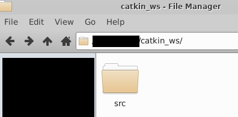
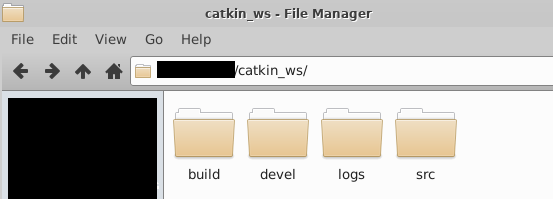

# 2-2：ワークスペース

[前ページ(2-1：ROSの仕組み)](../02_base/2-01.md)　｜　[目次へ戻る](../index.md)　｜　[次ページ(2-3：パッケージ)](../02_base/2-03.md)
- - -
ここではROSのワークスペースについて説明します。

## ワークスペースの作成
ROSにはROSのパッケージを配置して開発したりビルドしたりするワークスペースを作成する必要があります。

ワークスペースはどこに作成しても良いですが、ログインユーザのホームディレクトリに作成することが多いのでここでも同じ場所に作成します。

Terminalを開いて以下のコマンドでホームディレクトリにワークスペース用のディレクトリである「catkin_ws」を作成します。
~~~shell
mkdir ~/catkin_ws
~~~
ディレクトリ作成ができたら、以下のコマンドで作成したワークスペースのディレクトリに移動します。
~~~shell
cd ~/catkin_ws/
~~~
移動後、以下のコマンドを実行して「src」ディレクトリを作成します。
~~~shell
mkdir src
~~~
これで以下のようにcatkin_wsディレクトリ内にsrcディレクトリがある状態になります。

ここまでできたらROSのコマンドを実行する準備として、おまじないのコマンドを実行します。
~~~shell
source /opt/ros/noetic/setup.bash
~~~
そして「catkin_ws」ディレクトリ内で以下のコマンドを実行し、ROSのワークスペースとして設定します。
~~~shell
catkin build
~~~
このコマンドを実行すると色々とメッセージが出てきますが、最後の方にある「Failed」の項目に何も表示されていないことを確認してください。何か表示が出てきている場合はおまじないコマンドを実行していない場合があるので、一度おまじないを実行してから再度実行してみてください。
~~~shell
# ここより前は色々と出てきている
Starting  >>> catkin_tools_prebuild                                            
Finished  <<< catkin_tools_prebuild                [ 2.1 seconds ]             
[build] Summary: All 1 packages succeeded!                                     
[build]   Ignored:   None.                                                     
[build]   Warnings:  None.                                                     
[build]   Abandoned: None.                                                     
[build]   Failed:    None.                                                     
[build] Runtime: 2.1 seconds total. 
~~~
コマンドが問題なく終了すると、以下のように「build」、「devel」、「logs」のフォルダが新たに作成されています。

各ディレクトリは、簡単に説明すると以下のようになっています。
|名称|説明|
|---|---|
|build|パッケージをビルドしたファイルが置かれる場所。|
|devel|ROSワークスペースに関係するシェルやライブラリなどが置かれる場所。|
|logs|ビルドや実行時のログが保存される場所。|
|src|パッケージを置く場所。開発する時はここを使う。|

これでワークスペースが出来上がったので、次は実際にパッケージを作っていきます。
- - -
[前ページ(2-1：ROSの仕組み)](../02_base/2-01.md)　｜　[目次へ戻る](../index.md)　｜　[次ページ(2-3：パッケージ)](../02_base/2-03.md)
- - -