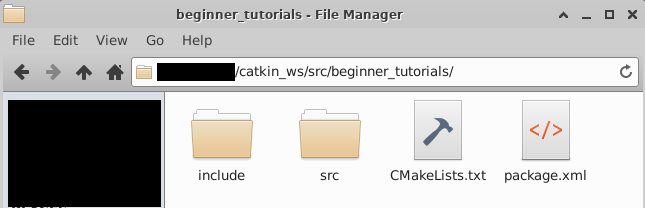

# 2-3：パッケージ

[前ページ(2-2：ワークスペース)](./2-02.md)　｜　[目次へ戻る](../index.md)　｜　[次ページ(2-4：PublisherとSubscriber(C++))](./2-04.md)
- - -
ここではパッケージについて説明していきます。

## パッケージの作成
パッケージの作成は以下のコマンドで行います。
~~~shell
catkin_create_pkg <package_name> [depend1] [depend2] [depend3] ...
~~~
package_nameはパッケージ名、dependは依存するライブラリを記述します。

またパッケージの作成は必ず<strong>「src」ディレクトリか、その中に含まれるディレクトリ配下</strong>で行います。そうでなければ、ROSがパッケージとして認識できなくなるので注意してください。

では実際に「beginner_tutorials」という名前でパッケージを作成してみます。

以下のコマンドでsrcディレクトリに移動します。
~~~shell
cd ~/catkin_ws/src
~~~
以下のコマンドでパッケージを作成します。
~~~shell
catkin_create_pkg beginner_tutorials std_msgs rospy roscpp
~~~
catkin_create_pkgのコマンドで説明したように「beginner_tutorials」の部分がパッケージ名、「std_msgs rospy roscpp」の3つが依存するライブラリになっています。

実行後、srcディレクトリ内に「beginner_tutorials」ディレクトリが作成され、その中は以下のようになっています。

これがROSパッケージの最小構成であり、それぞれ以下のような役割があります。
|名称|説明|
|---|---|
|srcディレクトリ|C++のソースコードを配置する場所。|
|includeディレクトリ|C++のヘッダファイルやローカルで使うライブラリなどを配置する場所。|
|CMakeLists.txt|パッケージをビルドする際の設定を記述するファイル。必須。|
|package.xml|パッケージで使うライブラリや外部パッケージなどの依存関係を記述するファイル。必須。|

### ・package.xml
まずはpackage.xml見ていくのでファイルをエディタで開いてみてください。Visual Studio Codeなどで開くとコメント行など色付けがされるので見やすいと思います。

色々と書かれてあったり、コメント行も多いですが、このファイルで重要なのは以下の部分です。
~~~xml
  <buildtool_depend>catkin</buildtool_depend>
  <build_depend>roscpp</build_depend>
  <build_depend>rospy</build_depend>
  <build_depend>std_msgs</build_depend>
  <build_export_depend>roscpp</build_export_depend>
  <build_export_depend>rospy</build_export_depend>
  <build_export_depend>std_msgs</build_export_depend>
  <exec_depend>roscpp</exec_depend>
  <exec_depend>rospy</exec_depend>
  <exec_depend>std_msgs</exec_depend>
~~~
ここの部分でライブラリや外部パッケージなどの依存関係を記述しています。

各タグに記述する内容は以下のようになります。
|タグ名|説明|
|---|---|
|<buildtool_depend>|ビルドツールの指定。基本的に「catkin」の記述で固定。|
|<build_depend>|ビルド時の依存を指定。基本的にCMakeList.txtで指定するものは全てこのタグで指定。|
|<build_export_depend>|ビルド依存のエクスポートの指定。|
|<exec_depend>|実行時の依存の指定。|
|\<depend\>|このタグを記述すると<build_depend>、<build_export_depend>、<exec_depend>の3つを指定したのと同じ効果。|
|<test_depend>|テスト実行時の依存を指定。|
|<doc_depend>|doxygen等のドキュメント作成用の依存を指定。|

どこでどう依存しているかわからない場合は、とりあえず\<depends\>タグを使うようにしておけば問題ないかと思います。

この他にもタグはありますが\<export\>タグは特定の場合にしか使いませんし、その他のタグは特に説明しなくても内容がわかるのとデフォルトのままでもとりあえず動作には問題ないのでここでは特に説明はしません。

### ・CMakeLists.txt
ここではビルド時に必要なライブラリやパッケージの記述、ビルドに含めるファイル名などを記述します。
色々と項目があり複雑なので、編集する時に別途説明します。

とりあえずこれで何もないパッケージができたので、次にビルドをやっていきます。

## パッケージのビルド
パッケージのビルドは以下のコマンドで実行します。
~~~shell
catkin build <パッケージ名>
~~~

今回は「beginner_tutorials」というパッケージ名なので以下のコマンドを「catkin_ws/src」ディレクトリ内で実行します。
~~~shell
cd ~/catkin_ws/src
catkin build beginner_tutorials
~~~

特に問題がなければ以下のような表示になっているはずです。
~~~shell
# ここまで色々な処理
----------------------------------------------------------
Workspace configuration appears valid.
----------------------------------------------------------
[build] Found 1 packages in 0.0 seconds.                                       
[build] Updating package table.                                                
Starting  >>> beginner_tutorials                                               
Finished  <<< beginner_tutorials                [ 2.2 seconds ]                
[build] Summary: All 1 packages succeeded!                                     
[build]   Ignored:   None.                                                     
[build]   Warnings:  None.                                                     
[build]   Abandoned: None.                                                     
[build]   Failed:    None.                                                     
[build] Runtime: 2.2 seconds total.                                            
[build] Note: Workspace packages have changed, please re-source setup files to use them.
~~~

コマンドが実行できない、もしくはビルド時にエラーや問題が発生した場合は以前に出てきたROSコマンドを実行するためのおまじないをやっていない可能性があるので、以下のおまじないを実行してから再度ビルドコマンドを行ってみてください。
~~~shell
source /opt/ros/noetic/setup.bash
~~~

これでパッケージのビルドができました。

## 環境変数の設定
ビルドしたパッケージのパスを環境変数に設定しなければ、ビルドしたパッケージを実行することができません。

まずは現在の環境変数を以下のコマンドで確認します。
~~~shell
echo $ROS_PACKAGE_PATH
~~~
実行するとおそらく以下のような結果が表示されると思います。
~~~shell
$ echo $ROS_PACKAGE_PATH
/opt/ros/noetic/share
~~~
ビルドしたパッケージを環境変数に設定する場合は、develディレクトリの中にあるsetup.bashを実行することで設定できるので、以下のコマンドを実行します。
~~~shell
source ~/catkin_ws/devel/setup.bash
~~~
実行すると以下のように「beginner_tutorials」までのパスが追加されています。
~~~shell
$ echo $ROS_PACKAGE_PATH
/home/xxxxx/catkin_ws/src/beginner_tutorials:/opt/ros/noetic/share
~~~

先にでてきたROSを使用するためのコマンドと、このパッケージを環境変数に設定するコマンドは基本的にはROSを実行するまえのおまじないコマンドになります。
なのでROSに関するコマンドの実行やビルド後に実行する際には、これら2つのコマンドを念のため実行しておくと良いかと思います。
~~~shell
source /opt/ros/noetic/setup.bash
source ~/catkin_ws/devel/setup.bash
~~~

毎回実行するのが面倒な場合は、「~/.bashrc」ファイルなどに記述しておくと自動的に読み込まれて実行されるようになります。
ですが、意識して毎回コマンドを実行する方が忘れないですし、シェルなどで自動起動させる際にも記述が必要になるため、面倒でも毎回実行するのが良いと個人的には思います。

これでパッケージに関する概要がわかったと思うので、次はPublisherとSubscriberを実装します。
- - -
[前ページ(2-2：ワークスペース)](./2-02.md)　｜　[目次へ戻る](../index.md)　｜　[次ページ(2-4：PublisherとSubscriber(C++))](./2-04.md)
- - -