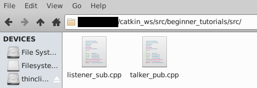
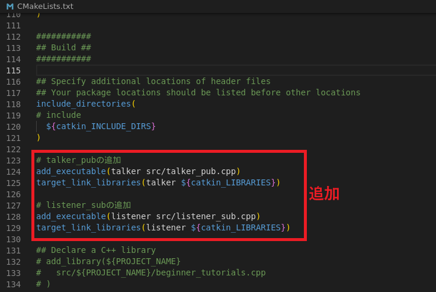
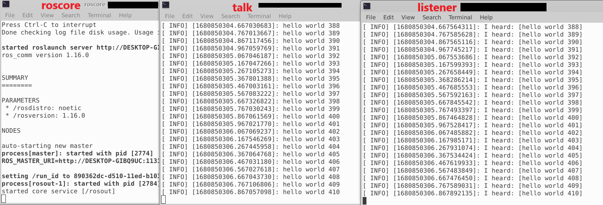

# 2-4：PublisherとSubscriber(C++)

[前ページ(2-3：パッケージ)](./2-03.md)　｜　[目次へ戻る](../index.md)　｜　[次ページ(2-5：PublisherとSubscriber(python))](./2-05.md)
- - -
ここではPublisherとSubscriberのC++実装について説明していきます。
PublisherとSubscriberがどんなものなのかは「[2-1：ROSの仕組み](./2-01.md)」で説明しているので割愛します。

またエディタはなんでも良いですが、Visual Studio Codeを入れておくと拡張機能も使えたりと色々便利なので個人的にはVisual Studio Codeを推奨します。

## Publisherの作成
「beginner_tutorials」パッケージの「src」ディレクトリ内に以下のファイルを作成します。コメントを読めばなんとなく内容はわかるかと思います。

・talker_pub.cpp
~~~c++
#include "ros/ros.h"         // ROSに関するヘッダーファイル
#include "std_msgs/String.h" // std_msgsパッケージのString(要は文字列を送るという意味)

#include <sstream>

/**
 * beginner_tutorialsのPublisherサンプル
 */
int main(int argc, char **argv)
{
  // ノード名を「talker」に設定(/を含んではいけない)
  ros::init(argc, argv, "talker");

  // ROSシステムで通信するためのNodeHandle
  ros::NodeHandle n;

  // Publisherの設定。
  // トピック名「chatter」で「std_msgs::String」型のメッセージを送る。
  // メッセージキューを1000とする。
  ros::Publisher chatter_pub = n.advertise<std_msgs::String>("chatter", 1000);
  // ROSの周波数設定。10Hz(つまり0.1秒ごとにPublish)
  ros::Rate loop_rate(10);

  // publish回数カウンタ
  int count = 0;

  // ROSが終了するまで無限ループ
  while (ros::ok())
  {
    // Publishするメッセージオブジェクト
    std_msgs::String msg;

    // メッセージを作成
    std::stringstream ss;
    ss << "hello world " << count;
    msg.data = ss.str();

    ROS_INFO("%s", msg.data.c_str()); // ROSのログにINFOレベルで書き込み

    // Publish実行(advertiseで設定した形でPublishされる)
    chatter_pub.publish(msg);

    // コールバック関数を一度実行
    // (このソースファイルではコールバックは設定してないのでなくてもよい)
    ros::spinOnce();
    // 設定周波数間隔になるようスリープ
    loop_rate.sleep();
    // Pub回数カウントアップ
    ++count;
  }

  return 0;
}
~~~

## Subscriberの作成
「beginner_tutorials」パッケージの「src」ディレクトリ内に以下のファイルを作成します。こちらもコメントを読めばなんとなく内容はわかるかと思います。

・listener_sub.cpp
~~~c++
#include "ros/ros.h"         // ROSに関するヘッダーファイル
#include "std_msgs/String.h" // std_msgsパッケージのString(要は文字列を受け取るという意味)

/**
 * beginner_tutorialsのSubscriberサンプル
 */

// Subscribeした際のコールバック関数
void chatterCallback(const std_msgs::String::ConstPtr& msg)
{
  ROS_INFO("I heard: [%s]", msg->data.c_str());
}

int main(int argc, char **argv)
{
  // ノード名を「listener」に設定(/を含んではいけない)
  ros::init(argc, argv, "listener");

  // ROSシステムで通信するためのNodeHandle
  ros::NodeHandle n;

  // Subscriberの設定。
  // トピック名「chatter」でSubscribeしたときにコールバック関数として「chatterCallback」を実行。
  // メッセージキューを1000とする。
  ros::Subscriber sub = n.subscribe("chatter", 1000, chatterCallback);

  // ROSの無限ループ待ち
  // (Subscribeされる度にコールバック関数が処理される)
  ros::spin();

  return 0;
}
~~~

## CMakeLists.txtの編集
PublisherとSubscriberのファイルが以下のようにできていると思います。

これらの追加したファイルをビルドして使えるようにするため、CMakeLists.txtを編集します。

エディタで開いて「include_directories」とあるあたりの下のところに以下の内容を追記して上書き保存します。
~~~cmake
# talker_pubの追加
add_executable(talker src/talker_pub.cpp)
target_link_libraries(talker ${catkin_LIBRARIES})

# listener_subの追加
add_executable(listener src/listener_sub.cpp)
target_link_libraries(listener ${catkin_LIBRARIES})
~~~
実際に追加すると以下のような形になります。

add_executableで対象のソースファイルを実行ファイルの中に追加しています。第一引数はノード名と一致させておくのが良いです。第二引数はパッケージからの相対パスを記述します。これで第一引数の名前で実行ファイルが作成されます。

target_link_librariesは実行ファイルをライブラリの中に加えるということをしています。なのでadd_executableとtarget_link_librariesの第一引数は一致させておく必要があります。

## ビルド
これで準備ができたのでビルドしていきます。

ビルド方法はすでに説明しているのでわかると思いますが、以下のコマンドをROSのワークスペース内で実行します。
~~~shell
catkin build beginner_tutorials
~~~
問題なければ以下のように表示されると思います。
~~~shell
# ここまで色々な処理
----------------------------------------------------------
Workspace configuration appears valid.
----------------------------------------------------------
[build] Found 1 packages in 0.0 seconds.                                       
[build] Package table is up to date.                                           
Starting  >>> beginner_tutorials                                               
Finished  <<< beginner_tutorials                [ 0.8 seconds ]                
[build] Summary: All 1 packages succeeded!                                     
[build]   Ignored:   None.                                                     
[build]   Warnings:  None.                                                     
[build]   Abandoned: None.                                                     
[build]   Failed:    None.                                                     
[build] Runtime: 0.8 seconds total.   
~~~
ビルドでエラーが発生したりした場合はどこかが間違っているので、ソースコードやCMakeLists.txtファイルを確認して修正してみてください。

## 実行
ROSを実行するには以下のコマンドが必要になります。

|コマンド|書き方|説明|
|---|---|---|
|roscore|(特になし)|ROSのMQTT Brokerを起動させるコマンド。基本的に必要。|
|rosrun|rosrun <パッケージ名> <実行ファイル名>|ビルドした実行ファイルを実行するコマンド。|

今回のビルドしたパッケージを実行するためにはTerminalを3つ立ち上げる必要があります。
また立ち上げたTerminal毎に以下の2つのおまじないコマンドを実行しておく必要があります。

~~~shell
source /opt/ros/noetic/setup.bash
source ~/catkin_ws/devel/setup.bash
~~~

ここまで出来たら、ぞれぞれのTerminalで以下のコマンドを実行します。

・Terminal1 (MQTTのBrokerを起動)
~~~shell
roscore
~~~
・Terminal2 (Publisherのtalkerを起動)
~~~shell
rosrun beginner_tutorials talker
~~~
・Terminal3 (Subscriberのlistenerを起動)
~~~shell
rosrun beginner_tutorials listener
~~~

それぞれ実行すると、以下のようにtalkの送信内容をlistenerが受信して表示させていることがわかると思います。talkの方を「Ctrl + C」で止めると、listener側の表示も止まります。

また「[2-1：ROSの仕組み](./2-01.md)」で説明したように、ノード ≒ プロセスなのでノード数分だけプロセスが動いています。場合によっては他にも色々でてきますが、以下のようにパッケージ名でgrepしたプロセス名で表示させると、ちゃんと呼び出したプロセスが存在しています。
~~~shell
$ ps aux | grep beginner_tutorials
xxxxxx     2877  0.5  0.2 348984 19452 pts/8    Sl+  16:04   0:00 /home/xxxxxx/catkin_ws/devel/lib/beginner_tutorials/listener
xxxxxx     2893  0.5  0.2 348896 19420 pts/6    Sl+  16:04   0:00 /home/xxxxxx/catkin_ws/devel/lib/beginner_tutorials/talker
~~~

これでROSで簡単なMQTTの通信を行うことができました。次のページではpythonでの書き方を説明します。
- - -
[前ページ(2-3：パッケージ)](./2-03.md)　｜　[目次へ戻る](../index.md)　｜　[次ページ(2-5：PublisherとSubscriber(python))](./2-05.md)
- - -