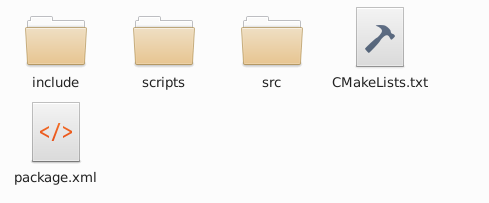
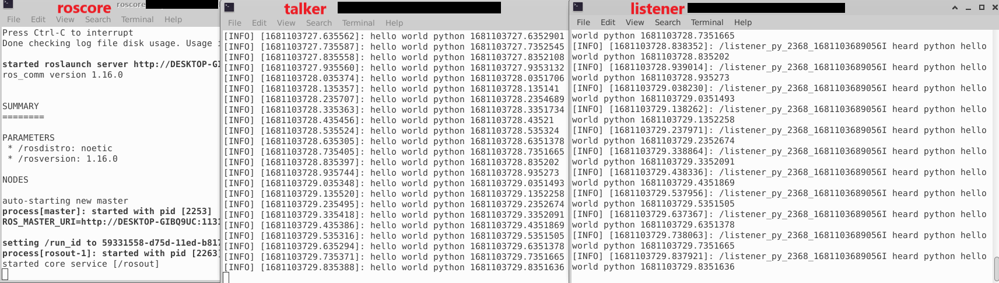

# 2-5：PublisherとSubscriber(python)

[前ページ(2-4：PublisherとSubscriber(C++))](./2-04.md)　｜　[目次へ戻る](../index.md)　｜　[次ページ(2-6：メッセージ)](./2-06.md)
- - -
ここではPublisherとSubscriberのpython実装について説明していきます。
PublisherとSubscriberがどんなものなのかは「[2-1：ROSの仕組み](./2-01.md)」で説明しているので割愛します。

またエディタはなんでも良いですが、Visual Studio Codeを入れておくと拡張機能も使えたりと色々便利なので個人的にはVisual Studio Codeを推奨します。

## pythonソースコードの配置場所
ROSにおけるパッケージで使用するC++のソースコードは、パッケージ内の「scriptsディレクトリ」に配置します。
C++の時とは違うディレクトリになるので注意してください。
またこのディレクトリはデフォルトでは作成されていないので、自分で作成する必要があります。

以下のコマンドでROSのパッケージに移動します。
~~~shell
cd ~/catkin_ws/src/beginner_tutorials
~~~
そして以下のmkdirコマンドで「scriptsディレクトリ」を作成します。
~~~shell
mkdir scripts
~~~
コマンド実行後、scriptsディレクトリが作成されるので、この中にpythonファイルを配置していきます。

## Publisherの作成
「beginner_tutorials」パッケージの「scripts」ディレクトリ内に以下のファイルを作成します。コメントを読めばなんとなく内容はわかるかと思います。
基本的にC++とほぼ同じことをやっているので、ソースコードを見比べると理解しやすいと思います。

・talker_pub.py
~~~python
#!/usr/bin/python3
import rospy                    # ROSに関するライブラリのインポート
from std_msgs.msg import String # std_msgsパッケージのString(要は文字列を送るという意味)

# Publishする関数
def talker():
  # ノード名を「talker_py」に設定(/を含んではいけない)
  rospy.init_node('talker_py', anonymous=True)

  # Publisherの設定。
  # トピック名「chatter_py」で「std_msgsのString」型のメッセージを送る。
  # メッセージキューを10とする。
  pub = rospy.Publisher('chatter_py', String, queue_size=10)

  # ROSの周波数設定。10Hz(つまり0.1秒ごとにPublish)
  rate = rospy.Rate(10)

  # ROSが終了するまで無限ループ
  while not rospy.is_shutdown():
    # Publishするメッセージを作成
    hello_str = "hello world python %s" % rospy.get_time()

    rospy.loginfo(hello_str) # ROSのログにINFOレベルで書き込み

    # Publishを実行
    pub.publish(hello_str)

    # 設定周波数間隔になるようスリープ
    rate.sleep()

if __name__ == '__main__':
  # ファイル実行時
  try:
    # talker関数を呼び出し
    talker()
  except rospy.ROSInterruptException:
    # ROSのエラーが出たら無視
    pass
~~~
C++のソースコードとの違いで一つだけ注意する点があるので書いておきます。

C++ではROSのスリープ関数の前に以下の記述をすることで、コールバック関数を一度処理すると書きました。
~~~c++
ros::spinOnce();
~~~
けれどpythonではコールバック関数を処理するという関数は存在しません。pythonではsleep関数が呼ばれた際にROS内部で自動的にコールバック関数が処理されるという仕様のようなので、このような記述は不要になります。

## Subscriberの作成
「beginner_tutorials」パッケージの「scripts」ディレクトリ内に以下のファイルを作成します。こちらもコメントを読めばなんとなく内容はわかるかと思います。
こちらも基本的にC++とほぼ同じことをやっているので、ソースコードを見比べると理解しやすいと思います。

・listener_sub.py
~~~python
#!/usr/bin/python3
import rospy                    # ROSに関するライブラリのインポート
from std_msgs.msg import String # std_msgsパッケージのString(要は文字列を受け取るという意味)

# Subscribeした際のコールバック関数
def callback(data):
  rospy.loginfo(rospy.get_caller_id() + 'I heard python %s', data.data)

# listener関数
def listener():
  # ノード名を「listener_py」に設定(/を含んではいけない)
  rospy.init_node('listener_py', anonymous=True)

  # Subscriberの設定。
  # トピック名「chatter_py」でSubscribeしたときにコールバック関数として「callback」を実行。
  rospy.Subscriber('chatter_py', String, callback)

  # ROSの無限ループ待ち
  # (Subscribeされる度にコールバック関数が処理される)
  rospy.spin()

if __name__ == '__main__':
  # ファイル実行時にlistener関数を呼び出し
  listener()
~~~

## ファイルの実行権限付与
pythonの場合はCMakeLists.txtファイルを編集する必要はありませんが、実行権限が付与されていないと必ずエラーが発生するのでC++の時に紹介したのと同じ手順で付与します。

まずはpythonソースコードのあるディレクトリに移動します。
~~~shell
cd ~/catkin_ws/beginner_tutorials/scripts
~~~
移動できたら、以下のコマンドで現在いるディレクトリ内のファイル全てに実行権限を付与します(※セキュリティを考えるとユーザ毎などで厳しく権限を管理した方が良いのですが、今回は楽をするためにとりあえず全てのユーザに権限を付与しています)。
~~~shell
chmod +x *
~~~
権限が付与できているかは以下のコマンドで確認できます。
~~~shell
ls -la
~~~
実行して以下のように権限のところに「x」が追加されていればOKです。
~~~shell
$ ls -la
total 16
drwxrwxr-x 2 xxxx xxxx 4096 Apr  7 15:11 .
drwxrwxr-x 6 xxxx xxxx 4096 Apr 10 13:10 ..
-rwxrwxr-x 1 xxxx xxxx 1038 Apr  7 15:18 listener_sub.py
-rwxrwxr-x 1 xxxx xxxx 1640 Apr  7 15:15 talker_pub.py
~~~

## ビルド
これで準備ができたのでビルドしていきます。

ビルド方法はすでに説明しているのでわかると思いますが、以下のコマンドをROSのワークスペース内で実行します。
~~~shell
catkin build beginner_tutorials
~~~
問題なければ以下のように表示されると思います。
~~~shell
# ここまで色々な表示
----------------------------------------------------------
Workspace configuration appears valid.
----------------------------------------------------------
[build] Found 1 packages in 0.0 seconds.                                       
[build] Package table is up to date.                                           
Starting  >>> beginner_tutorials                                               
Finished  <<< beginner_tutorials                [ 0.8 seconds ]                
[build] Summary: All 1 packages succeeded!                                     
[build]   Ignored:   None.                                                     
[build]   Warnings:  None.                                                     
[build]   Abandoned: None.                                                     
[build]   Failed:    None.                                                     
[build] Runtime: 0.8 seconds total.   
~~~
ビルドでエラーが発生したりした場合はどこかが間違っているので、ソースコードやCMakeLists.txtファイルを確認して修正してみてください。

## 実行
ROSの実行は基本的にはC++の時と同じです。

Terminalを3つ立ち上げ、立ち上げたTerminal毎に以下の2つのおまじないコマンドを実行しておく必要があります。
~~~shell
source /opt/ros/noetic/setup.bash
source ~/catkin_ws/devel/setup.bash
~~~

ここまで出来たら、ぞれぞれのTerminalで以下のコマンドを実行します。

・Terminal1 (MQTTのBrokerを起動)
~~~shell
roscore
~~~
・Terminal2 (Publisherのtalkerを起動)
~~~shell
rosrun beginner_tutorials talker_pub.py
~~~
・Terminal3 (Subscriberのlistenerを起動)
~~~shell
rosrun beginner_tutorials listener_sub.py
~~~

それぞれ実行すると、以下のようにtalkの送信内容をlistenerが受信して表示させていることがわかると思います。talkの方を「Ctrl + C」で止めると、listener側の表示も止まります。

またpythonでもC++の時と同じようにちゃんと呼び出したプロセスが存在しています。
~~~shell
$ ps aux | grep beginner_tutorials
xxxx     2561  6.0  0.5 430480 41028 pts/3    Sl+  14:31   0:00 /usr/bin/python3 /home/xxxx/catkin_ws/src/beginner_tutorials/scripts/talker_pub.py
xxxx     2579  7.0  0.6 504216 46820 pts/2    Sl+  14:31   0:00 /usr/bin/python3 /home/xxxx/catkin_ws/src/beginner_tutorials/scripts/listener_sub.py
xxxx     2633  0.0  0.0   9204   720 pts/4    S+   14:31   0:00 grep --color=auto beginner_tutorials
~~~

## rosrunコマンドでエラーが発生した場合
rosrunでpythonファイルを実行した際に、以下のようなエラーが発生する場合があります。
~~~python
/usr/bin/python: bad interpreter: No such file or directory
~~~
これはpythonのソースコードの一行目に書いた以下の部分でエラーが出ています。
~~~python
#!/usr/bin/python3
~~~
この一行は使用するpython3のパスを指定しているのですが、環境によってはこのパスが違っているためエラーになります。
これを解消するためにはまずTerminalで以下のコマンドを実行します。
~~~python
whereis python3
~~~
ROSをインストールするのと同時にpython3も入っているはずなので、このコマンドでエラーになることはないと思います。これでエラーになった場合はpython3を各自でインストールしてください。

実行すると以下のようにpython3に関するパスが表示されます。
~~~shell
$ whereis python3
python3: /usr/bin/python3 /usr/bin/python3.8-config /usr/bin/python3.8 /usr/lib/python3 /usr/lib/python3.8 /usr/lib/python3.9 /etc/python3 /etc/python3.8 /usr/local/lib/python3.8 /usr/include/python3.8d /usr/include/python3.8 /usr/share/python3 /usr/share/man/man1/python3.1.gz
~~~
上記のコマンドの結果にある一つ目(今回の結果では「/usr/bin/python3」)のパスをコピーして一行目を書き換えて上書保存してください。

これで実行すれば指定のpython3が呼ばれるのでエラーが出なくなります。

次のページではデータをやり取りするための型であるメッセージについて説明します。
- - -
[前ページ(2-4：PublisherとSubscriber(C++))](./2-04.md)　｜　[目次へ戻る](../index.md)　｜　[次ページ(2-6：メッセージ)](./2-06.md)
- - -