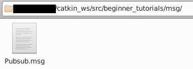

# 2-6：メッセージ

[前ページ(2-5：PublisherとSubscriber(python))](./2-05.md)　｜　[目次へ戻る](../index.md)　｜　[次ページ(2-7：サービス)](./2-07.md)
- - -
ここではメッセージについて説明します。

ここまでの説明でトピックでのPub、Subを説明してきましたが、やり取りしていたのは単に文字列だけでした。実際に使うとなるとトピックには複数の情報を持たせたりする場合が多いです。

その時に使うのがトピックを送る際の型ともいえるメッセージファイルになります。またC++とpythonなど言語が違う場合の共通の型として使う場合もあります。

## メッセージファイルの配置場所
メッセージファイルはパッケージ内の「msg」フォルダに作成します。デフォルトではこのフォルダは作成されてないので、手動で作成します。

以下のコマンドでROSのパッケージに移動します。
~~~shell
cd ~/catkin_ws/src/beginner_tutorials
~~~
そして以下のmkdirコマンドで「scriptsディレクトリ」を作成します。
~~~shell
mkdir msg
~~~
コマンド実行後、msgディレクトリが作成されるので、この中にメッセージファイルを配置していきます。

## メッセージファイルの作成
メッセージファイルは簡単なテキストファイルなので作成自体も難しくはありません。以下のように型名の後に半角スペースを入れ、その後に名前をつけるだけです。
~~~shell
[型名] [名前]
~~~

メッセージファイルで使える型は以下のものになります。
- int8, int16, int32, int64 (plus uint*)
- float32, float64
- string
- time, duration
- other msg files
- variable-length array[] and fixed-length array[C]

またROS固有のものとして以下のような例のものもあります。
- Header header
- string child_frame_id
- geometry_msgs/PoseWithCovariance pose
- geometry_msgs/TwistWithCovariance twist

では実際にメッセージファイルを作成してみます。作成した「msg」ディレクトリ内に以下のファイルを作成します。

・pubsub.msg
~~~shell
string msg
int64 count
~~~
メッセージの内容としては文字列として「msg」、数値として「count」を持つというシンプルなものになっています。

作成すると以下のようになっていると思います。

これでメッセージファイルは完成ですが、このメッセージファイルを使えるようにするには色々と面倒な手順を行う必要があります。

## 依存・ビルド設定
メッセージファイルの作成とソースコードでの記述が終わったら次は依存・ビルド設定を記述します。

まずは依存関係としてpackage.xmlを修正します。以下の2行を追記します。

・package.xml
~~~xml
<build_depend>message_generation</build_depend>
<exec_depend>message_runtime</exec_depend>
~~~
以下の赤枠部分が実際に追記したところです。

次にビルド設定を行うので、CMakeLists.txtを開いて以下のように修正します。

- find_packageの部分に「message_generation」を追加
- add_message_filesの部分のコメントアウトを外しFILESを残して「pubsub.msg」を記述
- generate_messagesの部分のコメントアウトを外す
- catkin_packageのCATKIN_DEPENDSの行のコメントアウトを外して「message_runtime」を追加

実際に行うと以下のようになっているはずです。

・CMakeLists.txt
~~~cmake
### ～省略～

find_package(catkin REQUIRED COMPONENTS
  roscpp
  rospy
  std_msgs
  message_generation # 追記
)

### ～省略～

# ↓ add_message_files部分のコメントアウトを外して「pubsub.msg」を記述
add_message_files(
  FILES
  pubsub.msg
)

### ～省略～

# generate_messagesのコメントアウトを外す
generate_messages(
  DEPENDENCIES
  std_msgs
)

### ～省略～

catkin_package(
#  INCLUDE_DIRS include
#  LIBRARIES beginner_tutorials
  # ↓コメントアウトを外して「message_runtime」を追加
  CATKIN_DEPENDS roscpp rospy std_msgs message_runtime
#  DEPENDS system_lib
)
~~~

ここまで出来たら以下のコマンドでパッケージをビルドします。
~~~shell
catkin build beginner_tutorials
~~~
実行して以下のようにエラーがないことを確認します。ここでエラーがあった場合はpackage.xmlとCMakeLists.txtの記述が間違っているので、確認して修正してください。
~~~shell
### ～省略～
----------------------------------------------------------
Workspace configuration appears valid.
----------------------------------------------------------
[build] Found 1 packages in 0.0 seconds.                                       
[build] Package table is up to date.                                           
Starting  >>> beginner_tutorials                                               
Finished  <<< beginner_tutorials                [ 3.8 seconds ]                
[build] Summary: All 1 packages succeeded!                                     
[build]   Ignored:   None.                                                     
[build]   Warnings:  None.                                                     
[build]   Abandoned: None.                                                     
[build]   Failed:    None.                                                     
[build] Runtime: 3.8 seconds total.  
~~~

これでメッセージができたので実際にソースコードで使ってみます。

## ソースコードでのメッセージファイルの使用方法(C++)
C++のソースコードで自作したメッセージファイルを使う方法は基本的にはメッセージファイルをincludeしてそれを使用していくだけです。「[2-4：PublisherとSubscriber(C++)](./2-04.md)」のソースコードをpubsub.msgを使うようにした場合のPublisherは以下のようになります。

・talker_msg_pub.cpp
~~~c++
#include "ros/ros.h"
#include "beginner_tutorials/pubsub.h" // 作成したメッセージ(パッケージ名/メッセージ名.hの形でinclude)

#include <sstream>

int main(int argc, char **argv)
{
  ros::init(argc, argv, "talker_msg");
  ros::NodeHandle n;

  // Publisherの設定(メッセージのpubsubを使用)
  ros::Publisher chatter_pub = n.advertise<beginner_tutorials::pubsub>("chatter_msg", 1000);
  ros::Rate loop_rate(10); // 10Hz

  // publish回数カウンタ
  int count = 0;

  // ROSが終了するまで無限ループ
  while (ros::ok())
  {
    // Publishするメッセージオブジェクト作成
    beginner_tutorials::pubsub data;
    data.msg = "hello world";
    data.count = count;

    // 表示用の文字列作成
    std::stringstream ss;
    ss << data.msg << ": " << data.count;
    char char_array[256];
    ss.get(char_array, 256);

    ROS_INFO("%s", char_array); // ROSのログにINFOレベルで書き込み

    // Publish実行(advertiseで設定した形でPublishされる)
    chatter_pub.publish(data);

    ros::spinOnce();
    loop_rate.sleep();

    ++count; // Pub回数カウントアップ
  }

  return 0;
}
~~~
Subscriberは以下のようになります。

・listener_msg_sub.cpp
~~~c++
#include "ros/ros.h"
#include "beginner_tutorials/pubsub.h" // 作成したメッセージ(パッケージ名/メッセージ名.hの形でinclude)

// Subscribeした際のコールバック関数(メッセージのpubsubを使用)
void chatterCallback(const beginner_tutorials::pubsub::ConstPtr& data)
{
  // 表示用の文字列作成
  std::stringstream ss;
  ss << data->msg << ": " << data->count;
  char char_array[256];
  ss.get(char_array, 256);

  ROS_INFO("I heard: [%s]", char_array); // ROSのログにINFOレベルで書き込み(表示)
}

int main(int argc, char **argv)
{
  ros::init(argc, argv, "listener_msg");
  ros::NodeHandle n;

  // Subscriberの設定。
  ros::Subscriber sub = n.subscribe("chatter_msg", 1000, chatterCallback);

  // ROSの無限ループ待ち
  ros::spin();

  return 0;
}
~~~

C++のソースファイルを追加したのでCMakeLists.txtに以下を追記します。

・CMakeLists.txt
~~~cmake
# talker_msg_pubの追加
add_executable(talker_msg src/talker_msg_pub.cpp)
target_link_libraries(talker_msg ${catkin_LIBRARIES})

# listener_msg_subの追加
add_executable(listener_msg src/listener_msg_sub.cpp)
target_link_libraries(listener_msg ${catkin_LIBRARIES})
~~~
実際に記述すると以下のようになります。

ここまで出来たら以下のコマンドでパッケージをビルドします。エラーが出た場合はどこかがおかしいのでもう一度確認と修正を行ってビルドしてみてください。
~~~shell
catkin build beginner_tutorials
~~~
エラーなくビルドができたら「[2-4：PublisherとSubscriber(C++)](./2-04.md)」と同じ手順で実行します。
・Terminal1
~~~shell
roscore
~~~
・Terminal2
~~~shell
rosrun beginner_tutorials talker_msg
~~~
・Terminal3
~~~shell
rosrun beginner_tutorials listener_msg
~~~
実行すると以下のようにちゃんとメッセージの内容で通信できていることが確認できると思います。

・Terminal2の表示例
~~~shell
[ INFO] [1681111561.000776997]: hello world: 191
[ INFO] [1681111561.100747092]: hello world: 192
[ INFO] [1681111561.200657944]: hello world: 193
[ INFO] [1681111561.300705306]: hello world: 194
[ INFO] [1681111561.401004039]: hello world: 195
~~~
・Terminal3の表示例
~~~shell
[ INFO] [1681111561.001510496]: I heard: [hello world: 191]
[ INFO] [1681111561.101465312]: I heard: [hello world: 192]
[ INFO] [1681111561.201182935]: I heard: [hello world: 193]
[ INFO] [1681111561.301368151]: I heard: [hello world: 194]
[ INFO] [1681111561.401711488]: I heard: [hello world: 195]
~~~

## ソースコードでのメッセージファイルの使用方法(python)
pythonのソースコードで自作したメッセージファイルを使う方法もC++の時と同じように基本的にはメッセージファイルをimportしてそれを使用していくだけです。「[2-5：PublisherとSubscriber(python)](./2-05.md)」のソースコードをpubsub.msgを使うようにした場合のPublisherは以下のようになります。

・talker_msg_pub.py
~~~python
#!/usr/bin/python3
import rospy
from beginner_tutorials.msg import pubsub # 作成したメッセージをインポート

# Publishする関数
def talker():
  rospy.init_node('talker_msg_py', anonymous=True)

  # Publisherの設定(メッセージとしてpubsubを使う)
  pub = rospy.Publisher('chatter_msg_py', pubsub, queue_size=10)
  rate = rospy.Rate(10) # 10Hz

  # Publish回数カウンタ
  count = 0

  # ROSが終了するまで無限ループ
  while not rospy.is_shutdown():
    # Publishするメッセージを作成
    pubsub_obj = pubsub()
    pubsub_obj.msg = "hello world python"
    pubsub_obj.count = count

    rospy.loginfo(pubsub_obj.msg + ": " + str(pubsub_obj.count)) # ROSのログにINFOレベルで書き込み

    # Publishを実行
    pub.publish(pubsub_obj)

    # 設定周波数間隔になるようスリープ
    rate.sleep()

    # カウントアップ
    count += 1

if __name__ == '__main__':
  try:
    talker()
  except rospy.ROSInterruptException:
    pass
~~~

Subscriberは以下のようになります。

・listener_msg_sub.py
~~~python
#!/usr/bin/python3
import rospy
from beginner_tutorials.msg import pubsub # 作成したメッセージをインポート

# Subscribeした際のコールバック関数
def callback(data):
  rospy.loginfo(rospy.get_caller_id() + 'I heard python %s', data.msg + ": " + str(data.count))

# listener関数
def listener():
  rospy.init_node('listener_msg_py', anonymous=True)

  # Subscriberの設定(メッセージとしてpubsubを使う)
  rospy.Subscriber('chatter_msg_py', pubsub, callback)

  # ROSの無限ループ待ち
  rospy.spin()

if __name__ == '__main__':
  listener()
~~~
メッセージファイルを使う場合も、依存・ビルド設定の手順ができていればpythonの場合はCMakeLists.txtを編集する必要はありません。

ここまで出来たら以下のコマンドでパッケージをビルドします。エラーが出た場合はどこかがおかしいのでもう一度確認と修正を行ってビルドしてみてください。
~~~shell
catkin build beginner_tutorials
~~~
エラーなくビルドができたら「[2-5：PublisherとSubscriber(python)](./2-05.md)」と同じ手順で実行します。実行できない場合はおまじないのコマンドを実行してから再度やってみてください。

・Terminal1
~~~shell
roscore
~~~
・Terminal2
~~~shell
rosrun beginner_tutorials talker_msg_pub.py
~~~
・Terminal3
~~~shell
rosrun beginner_tutorials listener_msg_sub.py
~~~
実行すると以下のような結果になり、ちゃんとメッセージの内容で通信できています。

・Terminal2の表示例
~~~shell
[INFO] [1681114715.145784]: hello world python: 25
[INFO] [1681114715.246076]: hello world python: 26
[INFO] [1681114715.346017]: hello world python: 27
[INFO] [1681114715.445755]: hello world python: 28
[INFO] [1681114715.545786]: hello world python: 29
[INFO] [1681114715.645814]: hello world python: 30
~~~
・Terminal3の表示例
~~~shell
[INFO] [1681114715.148399]: /listener_msg_py_7704_1681114710277I heard python hello world python: 25
[INFO] [1681114715.248756]: /listener_msg_py_7704_1681114710277I heard python hello world python: 26
[INFO] [1681114715.348762]: /listener_msg_py_7704_1681114710277I heard python hello world python: 27
[INFO] [1681114715.448918]: /listener_msg_py_7704_1681114710277I heard python hello world python: 28
[INFO] [1681114715.548061]: /listener_msg_py_7704_1681114710277I heard python hello world python: 29
[INFO] [1681114715.648923]: /listener_msg_py_7704_1681114710277I heard python hello world python: 30
~~~

## パッケージで使われているメッセージの確認
パッケージ内のmsgディレクトリ内のファイルを開いて確認していく方法もありますが、以下のコマンドを実行することでメッセージの中身を確認することもできます。
~~~shell
rosmsg show [パッケージ名]/[メッセージ名]
~~~
今回作成したメッセージを確認したい場合は以下のようになります。
~~~shell
$ rosmsg show beginner_tutorials/pubsub
string msg
int64 count
~~~

これでメッセージの使い方がわかったので、次はサービスについて説明していきます。

- - -
[前ページ(2-5：PublisherとSubscriber(python))](./2-05.md)　｜　[目次へ戻る](../index.md)　｜　[次ページ(2-7：サービス)](./2-07.md)
- - -