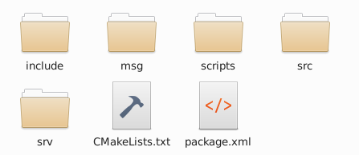
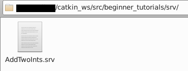
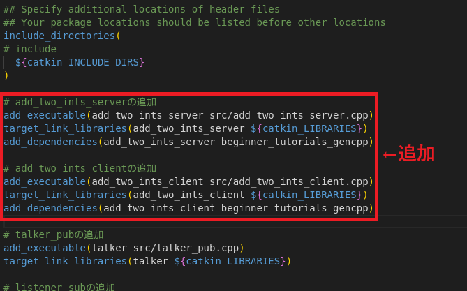

# 2-7：サービス

[前ページ(2-6：メッセージ)](./2-06.md)　｜　[目次へ戻る](../index.md)　｜　[次ページ(2-8：roslaunch(基本))](./2-08.md)
- - -
ここではサービスについて説明します。

サービスの概要は「[2-1：ROSの仕組み](./2-01.md)」で一度説明したように、以下の図のような同期処理になっています。

このサービスもメッセージと同じようにサービスでやり取りするための型のファイルを作成する必要があります。ちなみにサービスもメッセージも別のものなので、同一パッケージ内にサービスとメッセージは共存することができます。

## サービスファイルの配置場所
サービスファイルはパッケージ内の「srv」ディレクトリに作成します。デフォルトではこのディレクトリは作成されてないので、手動で作成します。

以下のコマンドでROSのパッケージに移動します。
~~~shell
cd ~/catkin_ws/src/beginner_tutorials
~~~
そして以下のmkdirコマンドで「srv」ディレクトリを作成します。
~~~shell
mkdir srv
~~~
コマンド実行後、srvディレクトリが作成されるので、この中にサービスファイルを配置していきます。

## サービスファイルの作成
サービスファイルも基本的にはメッセージファイルと書き方は同じで、以下のように型名の後に半角スペースを入れ、その後に名前をつけるだけです。
ただしサービスは関数の呼び出しと同じように要求(リクエスト)時に渡す値と応答(レスポンス)時に返す値があるため、その両方を記述する必要があります。
要求(リクエスト)時と応答(レスポンス)時の区切りは「---」を使用します。
~~~shell
[型名] [名前]
---
[型名] [名前]
~~~

サービスファイルもメッセージファイルと同様、使える型は以下のものになります。
- int8, int16, int32, int64 (plus uint*)
- float32, float64
- string
- time, duration
- other msg files
- variable-length array[] and fixed-length array[C]

ROS固有の例もメッセージファイルと同じです。
- Header header
- string child_frame_id
- geometry_msgs/PoseWithCovariance pose
- geometry_msgs/TwistWithCovariance twist

では実際にサービスファイルを作成してみます。作成した「srv」ディレクトリ内に以下のファイルを作成します。

・AddTwoInts.srv
~~~shell
int64 a
int64 b
---
int64 sum
~~~
サービスファイルの内容としては、要求(リクエスト)時にa, bの数値を渡し、応答(レスポンス)時に結果のsumという数値を受け取るという形になっています。

このサービスファイルを作成すると以下のようになっていると思います。

これでメッセージファイルは完成ですが、サービスファイルもメッセージファイル同様に使えるようにするには色々と面倒な手順を行う必要があります。

## 依存・ビルド設定
サービスファイルの場合も基本的にはメッセージファイルの時と同様です。

まずは依存関係としてpackage.xmlを修正します。以下の2行を追記します。

・package.xml
~~~xml
<build_depend>message_generation</build_depend>
<exec_depend>message_runtime</exec_depend>
~~~
以下の赤枠部分が実際に追記したところです。

次にビルド設定を行うので、CMakeLists.txtを開いて以下のように修正します。
メッセージの時とは違って「add_service_files」を使っているので注意してください。

- find_packageの部分に「message_generation」を追加
- add_service_filesの部分のコメントアウトを外しFILESを残して「AddTwoInts.srv」を記述
- generate_messagesの部分のコメントアウトを外す
- catkin_packageのCATKIN_DEPENDSの行のコメントアウトを外して「message_runtime」を追加

実際に行うと以下のようになっているはずです。

・CMakeLists.txt
~~~cmake
### ～省略～

find_package(catkin REQUIRED COMPONENTS
  roscpp
  rospy
  std_msgs
  message_generation # 追記
)

### ～省略～

# ↓ add_service_files部分のコメントアウトを外して「AddTwoInts.srv」を記述
add_service_files(
  FILES
  AddTwoInts.srv
)

### ～省略～

# generate_messagesのコメントアウトを外す
generate_messages(
  DEPENDENCIES
  std_msgs
)

### ～省略～

catkin_package(
#  INCLUDE_DIRS include
#  LIBRARIES beginner_tutorials
  # ↓コメントアウトを外して「message_runtime」を追加
  CATKIN_DEPENDS roscpp rospy std_msgs message_runtime
#  DEPENDS system_lib
)
~~~

ここまで出来たら以下のコマンドでパッケージをビルドします。
~~~shell
catkin build beginner_tutorials
~~~
実行して以下のようにエラーがないことを確認します。ここでエラーがあった場合はpackage.xmlとCMakeLists.txtの記述が間違っているので、確認して修正してください。
~~~shell
### ～省略～
----------------------------------------------------------
Workspace configuration appears valid.
----------------------------------------------------------
[build] Found 1 packages in 0.0 seconds.                                       
[build] Package table is up to date.                                           
Starting  >>> beginner_tutorials                                               
Finished  <<< beginner_tutorials                [ 4.8 seconds ]                
[build] Summary: All 1 packages succeeded!                                     
[build]   Ignored:   None.                                                     
[build]   Warnings:  None.                                                     
[build]   Abandoned: None.                                                     
[build]   Failed:    None.                                                     
[build] Runtime: 4.8 seconds total.  
~~~

これでサービスファイルができたので実際にソースコードで使ってみます。

## ソースコードでのサービスの使用方法(C++)
最初に図で示したように、サービスの場合はPublisher、Subscriberではなく、サービスサーバとサービスクライアントを作成する必要があります。

サービスサーバは以下のようになります。

・add_two_ints_server.cpp
~~~c++
#include "ros/ros.h"
#include "beginner_tutorials/AddTwoInts.h" // 作成したサービス(パッケージ名/サービス名.hの形でinclude)

/**
 * サービスサーバ(C++)のサンプル
 */
// 足し算を行う関数
bool add(beginner_tutorials::AddTwoInts::Request  &req,
         beginner_tutorials::AddTwoInts::Response &res)
{
  // リクエストのa, bの足し算を計算してレスポンスのsumに結果を設定
  res.sum = req.a + req.b;
  // ログに結果を出力
  ROS_INFO("request: x=%ld, y=%ld", (long int)req.a, (long int)req.b);
  ROS_INFO("sending back response: [%ld]", (long int)res.sum);

  // サービスのコールバック関数自体の結果を返す
  return true;
}

int main(int argc, char **argv)
{
  // ノード名「add_two_ints_server」
  ros::init(argc, argv, "add_two_ints_server");
  ros::NodeHandle n;

  // サービスサーバの定義
  // サービス名「add_two_ints」で呼ばれたときにコールバック関数「add」を実行
  ros::ServiceServer service = n.advertiseService("add_two_ints", add);
  ROS_INFO("Ready to add two ints.");

  // ROSの無限ループ待ち
  ros::spin();

  return 0;
}
~~~
サービスクライアントは以下のようになります。

・add_two_ints_client.cpp
~~~c++
#include "ros/ros.h"
#include "beginner_tutorials/AddTwoInts.h" // 作成したサービス(パッケージ名/サービス名.hの形でinclude)
#include <cstdlib>

/**
 * サービスクライアント(C++)のサンプル
 */

int main(int argc, char **argv)
{
  // ノード名「add_two_ints_client」
  ros::init(argc, argv, "add_two_ints_client");

  // ファイル実行時の引数の数を判定
  if (argc != 3)
  {
    ROS_INFO("usage: add_two_ints_client X Y");
    return 1;
  }

  ros::NodeHandle n;

  // サービスクライアントの定義
  // サービス名「add_two_ints」を呼び出す
  ros::ServiceClient client = n.serviceClient<beginner_tutorials::AddTwoInts>("add_two_ints");

  // サービスに送るリクエストのサービスを作成(ファイル実行時の引数を設定)
  beginner_tutorials::AddTwoInts srv;
  srv.request.a = atoll(argv[1]);
  srv.request.b = atoll(argv[2]);

  // サービスの呼び出し
  // サービスの処理が終了するまで待機になる(正常終了ならtrueが返ってくる)
  if (client.call(srv))
  {
    // 正常終了の場合
    ROS_INFO("Sum: %ld", (long int)srv.response.sum);
  }
  else
  {
    // 異常終了の場合
    ROS_ERROR("Failed to call service add_two_ints");
    return 1;
  }

  return 0;
}
~~~

C++のソースファイルを追加したのでCMakeLists.txtに以下を追記します。

・CMakeLists.txt
~~~cmake
# add_two_ints_serverの追加
add_executable(add_two_ints_server src/add_two_ints_server.cpp)
target_link_libraries(add_two_ints_server ${catkin_LIBRARIES})
add_dependencies(add_two_ints_server beginner_tutorials_gencpp)

# add_two_ints_clientの追加
add_executable(add_two_ints_client src/add_two_ints_client.cpp)
target_link_libraries(add_two_ints_client ${catkin_LIBRARIES})
add_dependencies(add_two_ints_client beginner_tutorials_gencpp)
~~~
実際に記述すると以下のようになります。

ここまで出来たら以下のコマンドでパッケージをビルドします。エラーが出た場合はどこかがおかしいのでもう一度確認と修正を行ってビルドしてみてください。
~~~shell
catkin build beginner_tutorials
~~~
エラーなくビルドができたら実行してみます。おまじないのコマンドをそれぞれ実行しておくのを忘れないようにしておいてください。またソースファイルに実行権限がついているかも確認しておいてください。

・Terminal1
~~~shell
roscore
~~~
・Terminal2
~~~shell
rosrun beginner_tutorials add_two_ints_server
~~~
・Terminal3
~~~shell
rosrun beginner_tutorials add_two_ints_client 1 3
rosrun beginner_tutorials add_two_ints_client 10 39
~~~
実行すると以下のようにちゃんとサービスファイルの内容で通信できていることが確認できると思います。

・Terminal2の表示
~~~shell
$ rosrun beginner_tutorials add_two_ints_server
[ INFO] [1681192714.998058092]: Ready to add two ints.
[ INFO] [1681192727.065578214]: request: x=1, y=3
[ INFO] [1681192727.065754881]: sending back response: [4]
[ INFO] [1681192739.173145743]: request: x=10, y=39
[ INFO] [1681192739.173264520]: sending back response: [49]
~~~
・Terminal3の表示
~~~shell
$ rosrun beginner_tutorials add_two_ints_client 1 3
[ INFO] [1681192727.066202034]: Sum: 4
$ rosrun beginner_tutorials add_two_ints_client 10 39
[ INFO] [1681192739.173620699]: Sum: 49
~~~

## ソースコードでのサービスの使用方法(python)
pythonでのサービスサーバは以下のようになります。

・add_two_ints_server.py
~~~python
#!/usr/bin/python3
import rospy
from beginner_tutorials.srv import * # サービスファイルすべて読み込み

"""
サービスサーバ(python)のサンプル
"""

# サービスが呼ばれた時のコールバック関数
def handle_add_two_ints(req):
  print("Returning [%s + %s = %s]"%(req.a, req.b, (req.a + req.b)))
  return AddTwoIntsResponse(req.a + req.b)

# メイン関数
def add_two_ints_server():
  # ノード名「add_two_ints_server_python」
  rospy.init_node('add_two_ints_server_python')

  # サービスクライアントの設定
  # サービス名「add_two_ints_python」で呼ばれたときにコールバック関数「handle_add_two_ints」を実行
  s = rospy.Service('add_two_ints_python', AddTwoInts, handle_add_two_ints)
  print("Ready to add two ints.")
  rospy.spin()

if __name__ == "__main__":
  add_two_ints_server()
~~~
サービスクライアントは以下のようになります。

・add_two_ints_client.py
~~~python
#!/usr/bin/python3
import sys
import rospy
from beginner_tutorials.srv import * # サービスファイルすべて読み込み

"""
サービスクライアント(python)のサンプル
"""

# サービスを実行する関数
def add_two_ints_client(x, y):
  # サービス名「add_two_ints_python」が使えるようになるまで待機
  rospy.wait_for_service('add_two_ints_python')

  try:
    # サービスのハンドラを作成
    add_two_ints = rospy.ServiceProxy('add_two_ints_python', AddTwoInts)
    # サービスの実行
    resp1 = add_two_ints(x, y)
    return resp1.sum
  except rospy.ServiceException as e:
    print("Service call failed: %s" % e)

# 引数がおかしい場合に表示する関数
def usage():
    return "%s [x y]"%sys.argv[0]

if __name__ == "__main__":
  # ファイル実行時の引数判定
  if len(sys.argv) == 3:
    # 引数の数が正しい場合
    x = int(sys.argv[1])
    y = int(sys.argv[2])
    print("Requesting %s+%s"%(x, y))
    print("%s + %s = %s"%(x, y, add_two_ints_client(x, y)))
  else:
    # 引数の数がおかしい場合
    print(usage())
    sys.exit(1)
~~~
メッセージファイルの時と同様に、サービスを使う場合も、依存・ビルド設定の手順ができていればpythonの場合はCMakeLists.txtを編集する必要はありません。

ここまで出来たら以下のコマンドでパッケージをビルドします。エラーが出た場合はどこかがおかしいのでもう一度確認と修正を行ってビルドしてみてください。
~~~shell
catkin build beginner_tutorials
~~~
エラーなくビルドができたら実行してみます。おまじないのコマンドをそれぞれ実行しておくのを忘れないようにしておいてください。またソースファイルに実行権限がついているかも確認しておいてください。

・Terminal1
~~~shell
roscore
~~~
・Terminal2
~~~shell
rosrun beginner_tutorials add_two_ints_server.py
~~~
・Terminal3
~~~shell
rosrun beginner_tutorials add_two_ints_client.py 1 3
rosrun beginner_tutorials add_two_ints_client.py 10 39
~~~
実行すると以下のようにちゃんとサービスファイルの内容で通信できていることが確認できると思います。

・Terminal2の表示
~~~shell
$ rosrun beginner_tutorials add_two_ints_server.py
Ready to add two ints.
Returning [1 + 3 = 4]
Returning [10 + 39 = 49]
~~~
・Terminal3の表示
~~~shell
$ rosrun beginner_tutorials add_two_ints_client.py 1 3
Requesting 1+3
1 + 3 = 4
$ rosrun beginner_tutorials add_two_ints_client.py 10 39
Requesting 10+39
10 + 39 = 49
~~~

## パッケージで使われているサービスの確認
パッケージ内のsrvディレクトリ内のファイルを開いて確認していく方法もありますが、メッセージと同様に以下のコマンドを実行することでサービスの中身を確認することもできます。
~~~shell
rossrv show [パッケージ名]/[サービスファイル名]
~~~
今回作成したサービスファイルを確認したい場合は以下のようになります。
~~~shell
$ rossrv show beginner_tutorials/AddTwoInts
int64 a
int64 b
---
int64 sum
~~~

これでサービスの説明は終了です。
- - -
[前ページ(2-6：メッセージ)](./2-06.md)　｜　[目次へ戻る](../index.md)　｜　[次ページ(2-8：roslaunch(基本))](./2-08.md)
- - -