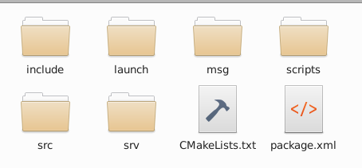
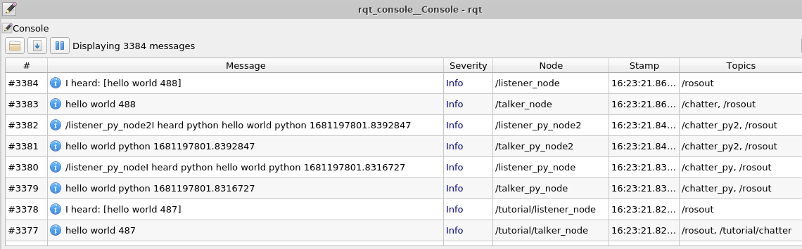

# 2-8：roslaunch(基本)

[前ページ(2-7：サービス)](./2-07.md)　｜　[目次へ戻る](../index.md)　｜　[次ページ(2-9：roslaunch(応用))](./2-09.md)
- - -
ここではroslaunchについて説明します。

色々とROSのノードを実行してきましたが、Terminal毎にrosrunで手打ちをするのは面倒だったと思います。そんな時にlaunchファイルを使えばまとめてノードを起動させることができます。

## launchファイルの特徴
launchファイルの特徴として以下の点が挙げられます。
- 対象のlaunchファイルを実行することで記述したノードをまとめて起動できる
- 起動対象のノード名が同じでも名前空間を変えることで別ノード扱いで起動できる
- トピックやノードのリネームができる
- roscoreが起動していない時は自動的にroscoreを起動させる
- ノード毎の起動設定(引数設定など)を行うことができる
- launchファイルからlaunchファイルを呼び出すことができる
- 単純な条件分岐も記述できる

ROSの開発を進めていくとノードも増えていくため、このlaunchファイルの作成が必要になってきます。

## launchファイルの配置場所
launchファイルはパッケージ内の「launch」ディレクトリに作成します。デフォルトではこのディレクトリは作成されてないので、手動で作成します。

以下のコマンドでROSのパッケージに移動します。
~~~shell
cd ~/catkin_ws/src/beginner_tutorials
~~~
そして以下のmkdirコマンドで「launch」ディレクトリを作成します。
~~~shell
mkdir launch
~~~
コマンド実行後、launchディレクトリが作成されるので、この中にlaunchファイルを配置していきます。

## 基本となるlaunchファイルの作成
launchファイルはxml形式で記述します。基本的な書き方としては以下のようになります。

|タグ名|説明|
|---|---|
|\<launch\>|基本となるタグ。この中にノード起動などの記述を行う。|
|\<node\>|ノードを起動する際に記述するタグ。要素としてpkg="パッケージ名"、name="起動時のノード名"、type="ノードの実行ファイル名"を指定する。output="screen"要素を追加することでTerminal上にログを表示させることも可能。|
|\<group\>|名前空間の指定をするタグ。これを設定すると同じノード名でも同一roscoreに存在可能になる。|
|\<remap\>|トピック名を変更するタグ。要素としてfrom="元のトピック名"、to="新しいトピック名"を指定する|

では実際にlaunchディレクトリ内に以下のlaunchファイルを作成します。

・pubsub.launch
~~~xml
<launch>

  <!-- c++のpub, subを実行 -->
  <node pkg="beginner_tutorials" name="talker_node" type="talker"/>
  <node pkg="beginner_tutorials" name="listener_node" type="listener"/>

  <!-- pythonのpub, subを実行 -->
  <node pkg="beginner_tutorials" name="talker_py_node" type="talker_pub.py"/>
  <node pkg="beginner_tutorials" name="listener_py_node" type="listener_sub.py"/>

  <!-- c++のpub, subを別グループとして実行(名前空間として別になるのでノード名が同じでも共存可能) -->
  <group ns="tutorial">
    <node pkg="beginner_tutorials" name="talker_node" type="talker"/>
    <node pkg="beginner_tutorials" name="listener_node" type="listener"/>
  </group>

  <!-- pythonのpub, subのトピック名を変更して実行 -->
  <node pkg="beginner_tutorials" name="talker_py_node2" type="talker_pub.py">
    <remap from="chatter_py" to="chatter_py2"/>
  </node>
  <node pkg="beginner_tutorials" name="listener_py_node2" type="listener_sub.py">
    <remap from="chatter_py" to="chatter_py2"/>
  </node>

</launch>
~~~
説明とxmlファイルのコメントでだいたいの書き方と意味はわかると思います。

## launchファイルの実行
launchファイルを実行するためには、以下のコマンドを使用します。
~~~shell
roslaunch [パッケージ名] [launchファイル名]
~~~
今回は「beginner_tutorials」パッケージにある「pubsub.launch」を実行するので、以下のようなコマンドになります。
~~~shell
roslaunch beginner_tutorials pubsub.launch
~~~
コマンドが実行できずにエラーになる場合は、launchファイルの実行権限を確認して実行権限がなければ付与してください。おまじないのコマンドを実行しておくのも忘れないようにしてください。

コマンドを実行してエラーがなければ、以下のような表示になるかと思います。またroscoreを予め別のTerminalで起動させていない場合は自動的に起動します。
~~~shell
$ roslaunch beginner_tutorials pubsub.launch
... logging to

### 色々な表示～省略～

SUMMARY
========

PARAMETERS
 * /rosdistro: noetic
 * /rosversion: 1.16.0

NODES
  /
    listener_node (beginner_tutorials/listener)
    listener_py_node (beginner_tutorials/listener_sub.py)
    listener_py_node2 (beginner_tutorials/listener_sub.py)
    talker_node (beginner_tutorials/talker)
    talker_py_node (beginner_tutorials/talker_pub.py)
    talker_py_node2 (beginner_tutorials/talker_pub.py)
  /tutorial/
    listener_node (beginner_tutorials/listener)
    talker_node (beginner_tutorials/talker)

ROS_MASTER_URI=http://localhost:11311

process[talker_node-1]: started with pid [5804]
process[listener_node-2]: started with pid [5805]
process[talker_py_node-3]: started with pid [5806]
process[listener_py_node-4]: started with pid [5811]
process[tutorial/talker_node-5]: started with pid [5817]
process[tutorial/listener_node-6]: started with pid [5819]
process[talker_py_node2-7]: started with pid [5820]
process[listener_py_node2-8]: started with pid [5825]
~~~

output要素を設定していないので何も表示されません。なので別の方法で確認します。

新たにTerminalを起動させておまじないのコマンドを実行します。そして以下のコマンドを実行します。
~~~shell
rosrun rqt_console rqt_console
~~~
実行するとGUIが起動し、以下のようにトピックの内容などを確認できます。

roslaunchを終了させたい場合は「Ctrl + C」を連打して終了させます。

次のページではroslaunchの応用を説明します。
- - -
[前ページ(2-7：サービス)](./2-07.md)　｜　[目次へ戻る](../index.md)　｜　[次ページ(2-9：roslaunch(応用))](./2-09.md)
- - -