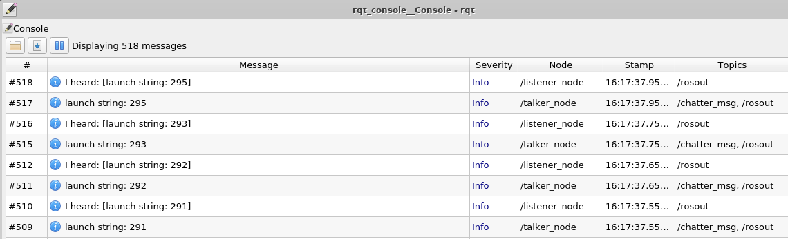
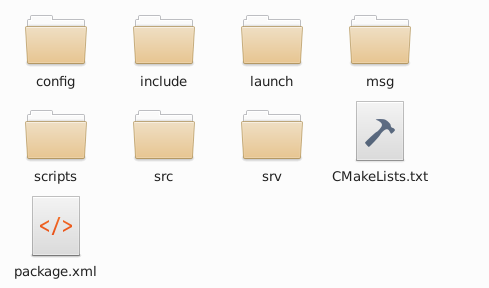

# 2-9：roslaunch(応用)

[前ページ(2-8：roslaunch(基本))](./2-08.md)　｜　[目次へ戻る](../index.md)　｜　[次ページ(2-10：rviz)](./2-10.md)
- - -
ここではroslaunchの応用について説明します。

前ページで説明した特徴の中で以下のものについて説明できていなかったので、応用編として説明していきます。

- ノード毎の起動設定(引数設定など)を行うことができる
- launchファイルからlaunchファイルを呼び出すことができる
- 単純な条件分岐も記述できる

## launchファイルでのノードの引数設定(直接指定)
ノードの引数設定を行うためには、C++の場合はソースコードに以下の記述を追加する必要があります。
~~~c++
// launchファイルからの引数を取得するNodeHandleを追加(必須)
ros::NodeHandle pnh("~");

// 引数の値を変数に設定
pnh.getParam([引数名], [変数名]);
~~~

実際に「talker_msg_pub.cpp」をノードの引数を使えるように修正すると、以下のようになります。パッケージの「src」ディレクトリ内にこのファイルを作成してください。

・talker_msg_pub_arg.cpp
~~~c++
#include "ros/ros.h"
#include "beginner_tutorials/Pubsub.h"

#include<string>
#include <sstream>

/**
 * C++のlaunch引数ありのサンプル
 */
int main(int argc, char **argv)
{
  ros::init(argc, argv, "talker_msg_arg");
  ros::NodeHandle nh;
  ros::NodeHandle pnh("~"); // launchファイルからの引数を取得するNodeHandleを追加(必須)

  // 引数の取得部分
  std::string arg_str = "msg_str"; // 初期値を指定
  pnh.getParam("msg", arg_str);    // 引数を変数に設定

  // Publisherの設定
  ros::Publisher chatter_pub = nh.advertise<beginner_tutorials::Pubsub>("chatter_msg", 1000);
  ros::Rate loop_rate(10);

  int count = 0;

  while (ros::ok())
  {
    beginner_tutorials::Pubsub data;
    data.msg   = arg_str; // 引数の内容をmsgに設定
    data.count = count;

    // 表示用の文字列作成
    std::stringstream ss;
    ss << data.msg << ": " << data.count;
    char char_array[256];
    ss.get(char_array, 256);

    ROS_INFO("%s", char_array);

    chatter_pub.publish(data); //Publish実行

    ros::spinOnce();
    loop_rate.sleep();

    ++count;
  }

  return 0;
}
~~~

launchファイルで引数を設定する方法は以下の記述で行います。

~~~xml
<!-- 引数の設定-->
<param name="引数名" value="渡す値"/>
~~~

作成した「talker_msg_pub_arg.cpp」に引数を渡すlaunchは以下のようになります。パッケージの「launch」ディレクトリ内にこのファイルを作成してください。

・pubsub_arg.launch
~~~xml
<launch>

  <!-- c++のpub(引数あり), subを実行 -->
  <node pkg="beginner_tutorials" name="talker_node" type="talker_msg_arg">
    <param name="msg" value="launch string"/> <!-- 引数の設定-->
  </node>
  <node pkg="beginner_tutorials" name="listener_node" type="listener_msg"/>

</launch>
~~~

今回新たにC++のファイルを追加したので、CMakeLists.txtに以下を追記します。

・CMakeLists.txt
~~~cmake
# talker_msg_pub_argの追加
add_executable(talker_msg_arg src/talker_msg_pub_arg.cpp)
target_link_libraries(talker_msg_arg ${catkin_LIBRARIES})
~~~

以下のコマンドでビルドします。エラーが出た場合はどこかが間違っているので、確認して修正し、再度ビルドしてください。

~~~shell
catkin build beginner_tutorials 
~~~

ビルドできたらおまじないのコマンドを実行し、以下のコマンドでlaunchファイルを実行します。

~~~shell
roslaunch beginner_tutorials pubsub_arg.launch
~~~

前ページでも出てきたGUIでトピックを確認するコマンドを実行して確認します。

~~~shell
rosrun rqt_console rqt_console
~~~

トピックの内容としてちゃんと引数で設定した「launch string」が使用されていることがわかると思います。

## launchファイルでのノードの引数設定(launchファイル自体の引数指定)
後で説明するようにlaunchファイルからlaunchファイルを呼び出すこともできるため、launchファイル呼び出し時に引数として値を持たせたい場合があります。

そのようなlaunchファイルに引数を持たせたい場合は以下のように書きます。

~~~xml
<!-- launchの引数(変数)の設定-->
<arg name="引数名" default="デフォルト値"/>

<!-- 引数の設定-->
<param name="引数名" value="$(arg launchの引数名)"/>
~~~

またpythonでノードの引数設定を行うためには、ソースコードに以下の記述を追加する必要があります。
~~~python
# 引数の値を変数に設定
hoge = rospy.get_param("~引数名", [デフォルト値])
~~~

書き方がわかったので「add_two_ints_client.py」をノードの引数を使えるように修正すると、以下のようになります。パッケージの「scripts」ディレクトリ内にこのファイルを作成してください。

・add_two_ints_client_arg.py
~~~python
#!/usr/bin/python3
import sys
import rospy
from beginner_tutorials.srv import *

"""
pythonのlaunch引数ありのサンプル
"""

# サービスを実行する関数
def add_two_ints_client(x, y):
  rospy.wait_for_service('add_two_ints_python')

  try:
    # サービスのハンドラを作成
    add_two_ints = rospy.ServiceProxy('add_two_ints_python', AddTwoInts)
    # サービスの実行
    resp1 = add_two_ints(x, y)
    return resp1.sum
  except rospy.ServiceException as e:
    print("Service call failed: %s" % e)

if __name__ == "__main__":
  # ノード名の設定(ノード名を設定してないと引数を受け取れない)
  rospy.init_node('add_two_ints_python_arg')

  # 引数の取得とデフォルト値の設定
  x = rospy.get_param("~add1", 1)
  y = rospy.get_param("~add2", 2)

  print("Requesting %s+%s"%(x, y))
  print("%s + %s = %s"%(x, y, add_two_ints_client(x, y)))
~~~

作成した「add_two_ints_client_arg.py」に引数を渡すlaunchは以下のようになります。パッケージの「launch」ディレクトリ内にこのファイルを作成してください。

・service_arg.launch
~~~xml
<launch>

  <!-- launchファイル自身の引数設定 -->
  <arg name="add1_launch" default="11"/>
  <arg name="add2_launch" default="12"/>

  <!-- pythonのサービスサーバとクライアントを実行-->
  <node pkg="beginner_tutorials" name="add_two_ints_server_py" type="add_two_ints_server.py"/>
  <!-- output="screen"を設定しているので、Terminalに表示される -->
  <node pkg="beginner_tutorials" name="add_two_ints_client_py" type="add_two_ints_client_arg.py" output="screen">
    <!-- 引数の設定 -->
    <param name="add1" value="$(arg add1_launch)"/>
    <param name="add2" value="$(arg add2_launch)"/>
  </node>

</launch>
~~~

pythonなのでビルドする必要はありません。以下のコマンドでlaunchファイルを実行します。

~~~shell
roslaunch beginner_tutorials service_arg.launch 
~~~

実行すると以下のように、launchファイルで設定したデフォルトの引数の値でサービスの計算結果が表示されます。

~~~shell
### 色々な表示～省略～

process[add_two_ints_server_py-2]: started with pid [7664]
process[add_two_ints_client_py-3]: started with pid [7668]
Requesting 11+12
11 + 12 = 23
[add_two_ints_client_py-3] process has finished cleanly
~~~

「Ctrl + C」で実行を止め、次に以下のコマンドで任意の値でlaunchファイルを実行してみます。

~~~shell
roslaunch beginner_tutorials service_arg.launch add1_launch:=50 add2_launch:=60
~~~

実行すると以下のように、コマンド時の引数として設定した値の引数でサービスの計算結果が表示されます。

~~~shell
### 色々な表示～省略～

process[add_two_ints_server_py-2]: started with pid [7760]
process[add_two_ints_client_py-3]: started with pid [7764]
Requesting 50+60
50 + 60 = 110
[add_two_ints_client_py-3] process has finished cleanly
~~~

## 引数をまとめて設定する
引数が大量にある場合、毎回paramタグをまとめて書くのは面倒です。paramタグよりももう少し楽に引数をまとめて設定する記述は以下の通りです。

~~~xml
<rosparam>
  [引数名1]: [値1]
  [引数名2]: [値2]
      .
      .
      .
</rosparam>
~~~

またyamlファイルを作成し、その中で引数の値を設定して渡すこともできます。

yamlファイルの書き方としては以下のようになります。また<strong>「listなどを渡したい場合はyamlファイルでなければ渡せない」</strong>ので注意してください。
~~~yaml
[ノード名]:
  [引数名1]: [値1]
  [引数名2]: [値2]
      .
      .
      .
~~~

そしてこのyamlファイルをlaunchファイルで呼び出す方法は以下の通りです。

~~~xml
<rosparam command="load" file="$(find [パッケージ名])/config/[yamlファイル名]"/>
~~~

これでyamlファイルの書き方がわかったので実際に作成してみます。

以下のコマンドでパッケージ内移動します。

~~~shell
cd ~/catkin_ws/src/beginner_tutorials
~~~

yamlファイルを配置する「config」ディレクトリを作成します。

~~~shell
mkdir config
~~~

作成すると以下のようになります。

configディレクトリの中に以下のyamlファイルを作成します。

・test_config.yaml
~~~yaml
add_two_ints_client_py:
  add1: 400
  add2: 401
~~~

これでrosparamタグで指定する方法とyamlファイルで指定する方法がわかったので、実際にlaunchファイルで記述します。

・rosparam.launch
~~~xml
<launch>

  <!-- 引数をまとめて実行するサンプル -->

  <group ns="rosparam">
    <node pkg="beginner_tutorials" name="add_two_ints_server_py" type="add_two_ints_server.py"/>

    <!-- rosparamで直接記述する場合 -->
    <node pkg="beginner_tutorials" name="add_two_ints_client_py" type="add_two_ints_client_arg.py" output="screen">
      <rosparam>
        add1: 300
        add2: 301
      </rosparam>
    </node>
  </group>

  <group ns="yaml">
    <node pkg="beginner_tutorials" name="add_two_ints_server_py" type="add_two_ints_server.py"/>

    <!-- yamlファイルを読み込む場合 -->
    <rosparam command="load" file="$(find beginner_tutorials)/config/test_config.yaml"/>
    <node pkg="beginner_tutorials" name="add_two_ints_client_py" type="add_two_ints_client_arg.py" output="screen"/>
  </group>
</launch>
~~~

実行すると、以下のようにちゃんと設定した値が引数で渡されていることがわかると思います。

~~~shell
process[rosparam/add_two_ints_server_py-2]: started with pid [3350]
process[rosparam/add_two_ints_client_py-3]: started with pid [3351]
process[yaml/add_two_ints_server_py-4]: started with pid [3352]
process[yaml/add_two_ints_client_py-5]: started with pid [3354]
Requesting 300+301
300 + 301 = 601
Requesting 400+401
400 + 401 = 801
[rosparam/add_two_ints_client_py-3] process has finished cleanly
[yaml/add_two_ints_client_py-5] process has finished cleanly
~~~

## launchファイルからlaunchファイルを呼び出す
launchファイルからlaunchファイルを呼び出すには以下のように記述します。

~~~xml
<!-- 引数なしでファイルを実行する場合 -->
<include file="$(find [パッケージ名])/launch/[launchファイル名]"/>

<!-- 引数ありでファイルを実行する場合 -->
<include file="$(find [パッケージ名])/launch/[launchファイル名]">
  <arg name="引数名" value="引数として渡す値"/>
</include>
~~~

書き方がわかったので「service_arg.launch」と「pubsub_arg.launch」を一つのlaunchファイルから実行させてみます。パッケージの「launch」ディレクトリ内に以下のファイルを作成してください。

・launch_call.launch
~~~xml
<launch>

  <!-- launchファイルを引数ありで実行 -->
  <include file="$(find beginner_tutorials)/launch/service_arg.launch">
    <arg name="add1_launch" value="100"/>
    <arg name="add2_launch" value="101"/>
  </include>

  <!-- launchファイルを引数なしで実行 -->
  <include file="$(find beginner_tutorials)/launch/pubsub_arg.launch"/>

</launch>
~~~

実行すると以下のように呼び出し先のlaunchファイルにあるノードが起動され、「service_arg.launch」に渡した値で計算されているのがわかります。

~~~shell
### 色々な表示～省略～

process[add_two_ints_server_py-2]: started with pid [8323]
process[add_two_ints_client_py-3]: started with pid [8328]
process[talker_node-4]: started with pid [8329]
process[listener_node-5]: started with pid [8330]
Requesting 100+101
100 + 101 = 201
[add_two_ints_client_py-3] process has finished cleanly
~~~

また起動中に以下のコマンドを実行すると、ちゃんと「pubsub_arg.launch」のPubSubが行われていることもわかります。

~~~shell
rosrun rqt_console rqt_console
~~~

## launchファイルでの条件分岐
launchファイルでは簡単な条件分岐も以下のように書けます。

・true/falseによる分岐
~~~xml
<arg name="hoge" default="true"/>

<group if="$(arg hoge)">
  <!-- trueの場合の処理 -->
</group>

<group unless="$(arg hoge)">
  <!-- falseの場合の処理 -->
</group>
~~~

・evalによる分岐(値判定などに使う)
~~~xml
<arg name="mode" default="mode0"/>

<group if="$(eval mode=='mode0' or mode=='mode1')">
  <!-- 条件に一致した場合の処理 -->
</group>

<group unless="$(eval mode=='mode0' or mode=='mode1')">
  <!-- 条件に一致しない場合の処理(ifの逆) -->
</group>
~~~

これで書き方がわかったので「service_arg.launch」と「pubsub_arg.launch」を条件分岐で起動させてみます。パッケージの「launch」ディレクトリ内に以下のファイルを作成してください。

・conditional_branch.launch
~~~xml
<launch>

  <!-- 条件分岐のデフォルト値 -->
  <arg name="mode" default="mode0"/>

  <group if="$(eval mode=='mode0' or mode=='mode1')">
    <!-- 値がmode0またはmode1の場合 -->
    <!-- launchファイルを引数ありで実行 -->
    <include file="$(find beginner_tutorials)/launch/service_arg.launch">
      <arg name="add1_launch" value="200"/>
      <arg name="add2_launch" value="201"/>
    </include>
  </group>

  <group if="$(eval mode=='mode2')">
    <!-- 値がmode2の場合 -->
    <!-- launchファイルを引数なしで実行 -->
    <include file="$(find beginner_tutorials)/launch/pubsub_arg.launch"/>
  </group>

</launch>
~~~

このlaunchファイルを以下のコマンドで実行すると「mode = "mode0"」となるので「service_arg.launch」が実行されます。

~~~shell
roslaunch beginner_tutorials conditional_branch.launch
~~~

次に以下のように引数として「mode:=mode1」を追加すると「mode = "mode1"」となるので「service_arg.launch」が実行されます。

~~~shell
roslaunch beginner_tutorials conditional_branch.launch mode:=mode1
~~~

以下のように引数として「mode:=mode2」を追加すると「mode = "mode2"」となるので「pubsub_arg.launch」が実行されます。

~~~shell
roslaunch beginner_tutorials conditional_branch.launch mode:=mode2
~~~

最後に以下のように引数として「mode:=mode3」を追加すると「mode = "mode3"」となり、どの条件にも当てはまらないのでどのlaunchファイルも実行されません。

~~~shell
roslaunch beginner_tutorials conditional_branch.launch mode:=mode3
~~~

これでlaunchファイルの記述は理解できたと思います。

- - -
[前ページ(2-8：roslaunch(基本))](./2-08.md)　｜　[目次へ戻る](../index.md)　｜　[次ページ(2-10：rviz)](./2-10.md)
- - -