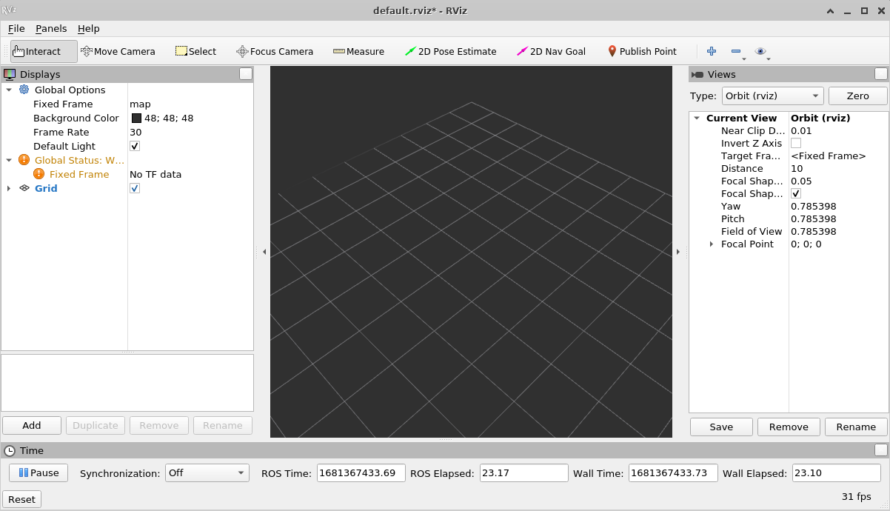
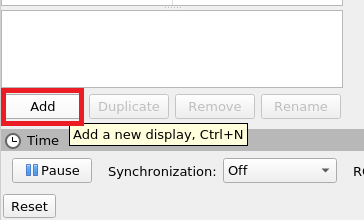
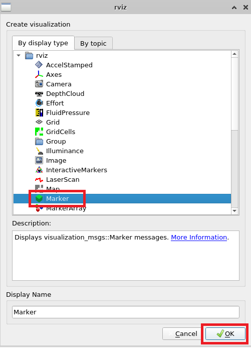
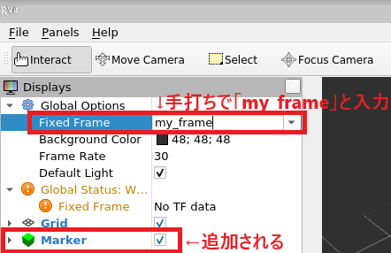
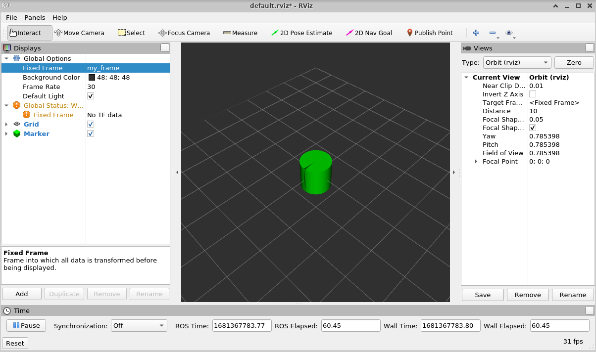
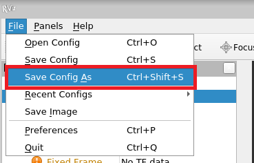
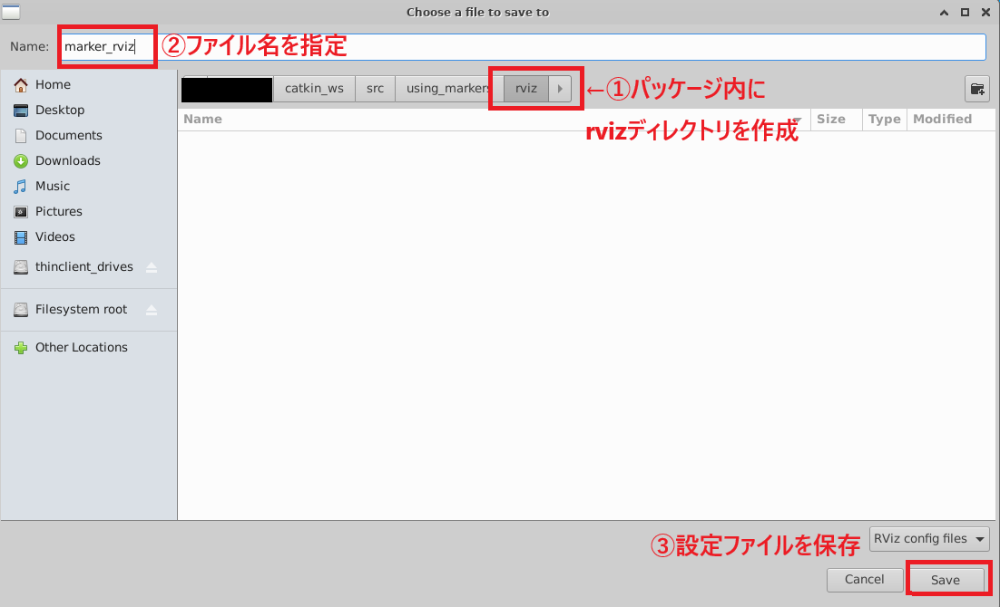

# 2-10：rviz

[前ページ(2-9：roslaunch(応用))](./2-09.md)　｜　[目次へ戻る](../index.md)　｜　[次ページ(2-11：rosコマンド)](./2-11.md)
- - -
ここではグラフィカルに表示するツールのrvizについて説明します。

## rvizについて

rviz(アールヴィズ)はROSの機能として組み込まれているグラフィカルに表示するためのツールです。

カメラからの画像やLiDARで測定した点群、ロボットのCADモデルの表示などができるので、必ずと言っていいほど使います。

## rvizを使う

rvizの練習のために新たにパッケージを作成しておきます。練習といってもrvizの機能や操作を知るためなので、ソースコード自体はそこまで重要ではないことを念頭に入れておいてください。

以下のコマンドでワークスペースの「src」ディレクトリに移動します。

~~~shell
cd ~/catkin_ws/src
~~~

以下のコマンドで「using_markers」という名前でパッケージを作成します。

~~~shell
catkin_create_pkg using_markers roscpp visualization_msgs
~~~

using_markersパッケージができたら、その中にある「src」ディレクトリ内に以下のファイルを作成します。

・basic_shapes.cpp
~~~c++
#include <ros/ros.h>
#include <visualization_msgs/Marker.h> // マーカー表示のメッセージファイルをinclude

/**
 * rvizにマーカーを表示させるサンプル
 * (ソースコードから直接図形を表示させることはまずないので内容としてそこまで重要ではない)
 */

int main( int argc, char** argv )
{
  // ノード名「basic_shapes」
  ros::init(argc, argv, "basic_shapes");
  ros::NodeHandle n;
  ros::Rate r(1); // 1Hz

  // 「visualization_marker」というトピック名でPublish
  ros::Publisher marker_pub = n.advertise<visualization_msgs::Marker>("visualization_marker", 1);

  // マーカータイプの初期値を「Cube」に設定
  uint32_t shape = visualization_msgs::Marker::CUBE;

  while (ros::ok())
  {
    // Publishするオブジェクト
    visualization_msgs::Marker marker;

    // フレームIDとタイムスタンプを設定(これらは後々出てきた段階で説明する)
    marker.header.frame_id = "my_frame";
    marker.header.stamp = ros::Time::now();

    // マーカーのネームスペースとIDを設定。IDはユニークである必要がある。
    marker.ns = "basic_shapes";
    marker.id = 0;

    marker.type = shape; // 形を設定

    // マーカーアクションを設定
    marker.action = visualization_msgs::Marker::ADD;

    // 表示させる座標位置と方向を設定
    marker.pose.position.x = 0;
    marker.pose.position.y = 0;
    marker.pose.position.z = 0;
    marker.pose.orientation.x = 0.0;
    marker.pose.orientation.y = 0.0;
    marker.pose.orientation.z = 0.0;
    marker.pose.orientation.w = 1.0;

    // 大きさを設定
    marker.scale.x = 1.0;
    marker.scale.y = 1.0;
    marker.scale.z = 1.0;

    // 色を設定
    marker.color.r = 0.0f;
    marker.color.g = 1.0f;
    marker.color.b = 0.0f;
    marker.color.a = 1.0;

    // ライフタイムを設定(ros::Duration()でライフタイムは無限)
    marker.lifetime = ros::Duration();

    // マーカーをPublish
    marker_pub.publish(marker);

    // 形を変更
    switch (shape)
    {
    case visualization_msgs::Marker::CUBE:
      shape = visualization_msgs::Marker::SPHERE;
      break;
    case visualization_msgs::Marker::SPHERE:
      shape = visualization_msgs::Marker::ARROW;
      break;
    case visualization_msgs::Marker::ARROW:
      shape = visualization_msgs::Marker::CYLINDER;
      break;
    case visualization_msgs::Marker::CYLINDER:
      shape = visualization_msgs::Marker::CUBE;
      break;
    }

    r.sleep();
  }
}
~~~

読めばなんとなくわかると思いますが、要は1秒毎に表示するマーカーを切り替えているソースコードになります。コード内に出てきているフレームやタイムスタンプについては、また別途説明します。

C++のソースコードを追加したので、using_markersパッケージの「CMakeLists.txt」に以下を追記します。

・CMakeLists.txt
~~~cmake
add_executable(basic_shapes src/basic_shapes.cpp)
target_link_libraries(basic_shapes ${catkin_LIBRARIES})
~~~

ソースコードの追加とCMakeLists.txtの追記ができたら、ワークスペース内で以下のコマンドを実行してビルドします。エラーが出た場合はどこかが間違っているので確認して修正し、再度ビルドしてください。

~~~shell
catkin build using_markers  
~~~

エラーなくビルドができたら以下のようにそれぞれターミナルを立ち上げてコマンドを実行します。おまじないコマンドの実行は忘れないようにしてください。

また起動する順番もTerminal1から数字の順番通りに実行してください。

・Terminal1(roscore)
~~~shell
roscore
~~~
・Terminal2(マーカー表示)
~~~shell
rosrun using_markers basic_shapes
~~~
・Terminal3(rviz)
~~~shell
rosrun rviz rviz
~~~

rvizを起動させると、以下のようなrvizのGUIが表示されますが、マーカーは表示されていません。

なので、マーカーを表示させるためにGUIを色々と設定していきます。

画面左下にある「Add」ボタンをクリックします。

ダイアログが表示されるので「Marker」を選択して「OK」ボタンをクリックします。

画面左側にある項目に「Marker」が追加されてチェックが入っているのを確認し、「Fixed Frame」の項目をクリックしてキーボードの手打ちで「my_frame」と入力します。

すると以下のように画面の中心位置にマーカーが表示され、1秒毎に形が変化していきます。

ちなみにMakerのチェックを外すと表示されなくなります。

このようにrvizでは任意の項目を追加して表示させたり、チェックを外して表示させなくしたりなどができます。

## rvizの設定ファイル

rvizをデフォルトのまま起動していると、マーカーを追加してフレーム名を変更して、という手間が毎回発生します。これは非常に面倒です。

現在の画面の状態を設定ファイルとして保存し、起動時にそのファイルを読み込ませることもできるのでそのやり方を説明していきます。

rvizで保存したい画面の状態にして、上部メニューの「File」→「Save Config As」を選択します。

設定ファイル保存のダイアログが表示されます。rvizの設定ファイルはパッケージ内の「rviz」フォルダに保存するので、予め作成しておき、ファイル名を指定して「Save」ボタンを押下して保存します。

保存した.rviz拡張子のファイルは色々と複雑な構成になっているため、特に説明はしません。基本的には画面の表示する構成などが列挙されているような形式になっています。

rvizの設定ファイルを起動時に読み込ませるには、以下のコマンドを使用します。

~~~shell
rosrun rviz rviz -d [rviz設定ファイルパス]
~~~

今回作成したrviz設定ファイルを起動時に読み込む場合は、以下のコマンドになります。

・Terminal3(設定ファイルを読み込んでrviz起動)
~~~shell
rosrun rviz rviz -d ~/catkin_ws/src/using_markers/rviz/marker_rviz.rviz
~~~

これでrvizの必要最低限の使い方がわかったと思います。

- - -
[前ページ(2-9：roslaunch(応用))](./2-09.md)　｜　[目次へ戻る](../index.md)　｜　[次ページ(2-11：rosコマンド)](./2-11.md)
- - -