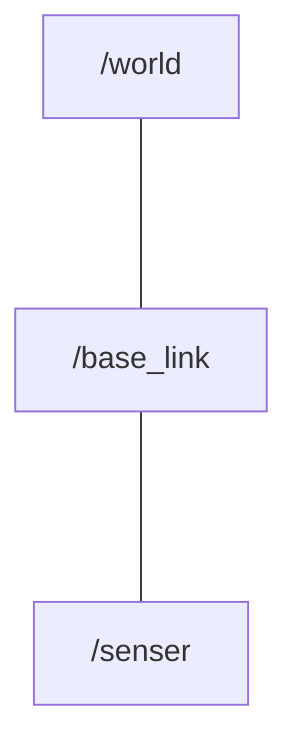

# 3-1：tfとフレームの概要

[前ページ(2-11：rosコマンド)](../02_base/2-11.md)　｜　[目次へ戻る](../index.md)　｜　[次ページ(3-2：tfのbroadcasterとlistener(C++))](./3-02.md)
- - -
ここではtfとフレームの概要について説明します。

## tfについて

tf(transform)はROSにおける重要なシステムの一つで、以下のものを扱います。

|名称|説明|
|---|---|
|3次元の座標の連鎖関係|木構造で管理|
|3次元の姿勢|quaternionで管理|
|時間|上記2つの発生した時間(タイムスタンプ)などを管理|

tfにもPublisher、Subscriberのようにtfを配信する「tf broadcaster」、tfを受信する「tf listener」を定義します。

これらを使ってロボットの現在地や姿勢、時間などのtfの情報をやり取りすることにより、ロボットを制御することができます。

tfは木構造にすることができるため、全ての基準となる世界の座標系 → ロボットの基準となる座標系 → センサーの座標系など数珠繋ぎにすることができます。

またtfには位置関係が永久的に変わらない「静的tf(static tf)」と、世界の座標系の中を動き回るロボットのように位置関係が変化する「動的tf(dynamic tf)」の2種類が存在します。

## フレームについて

フレームはROSにおける座標系のことを言い、頭に「/」を付けて表現することが多いです。「[2-10：rviz](../02_base/2-10.md)」のサンプルコードで出てきたフレームのことです。

フレームは座標系なので、先に挙げた数珠繋ぎの「一つ一つのtfの要素＝フレーム」になります。例えば以下のような形です。

|フレーム名(例)|内容|
|---|---|
|/world|全ての基準となる世界の座標系|
|/base_link|ロボットの基準となる座標系|
|/senser|センサーの座標系|

そしてフレームは木構造にできるので、以下のように「world」を一番上の親フレームとし、その下に子フレームの「base_link」、そのさらにまた子フレームとして「senser」という形にすることができます。

ROSにおけるフレームの親子関係は以下のようなルールがあります。

- 子フレームは複数登録できる
- 親フレームは1つしか登録できない
- ループ構造にはできない

またフレーム間の位置関係をROSに登録しておくことで、TF同士の位置関係は自動計算されるようになっています。

例えばロボットの基準となる「base_link」の座標からセンサーの物理的な位置が10cm前にある場合は、その10cm分ずらしたところに「senser」フレームを登録しておくことで自動的にそのずらした分を考慮してtfを計算してくれるということです。

次ページからはこのtfとフレームを使ったサンプルを作っていきます。

- - -
[前ページ(2-11：rosコマンド)](../02_base/2-11.md)　｜　[目次へ戻る](../index.md)　｜　[次ページ(3-2：tfのbroadcasterとlistener(C++))](./3-02.md)
- - -