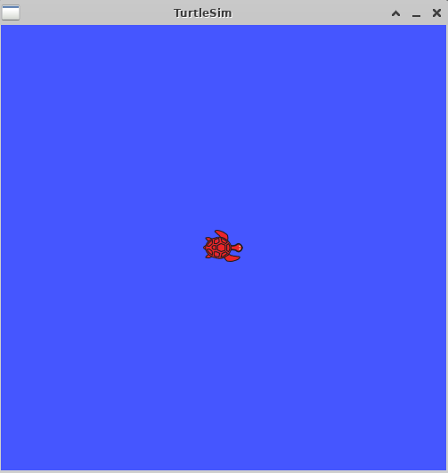
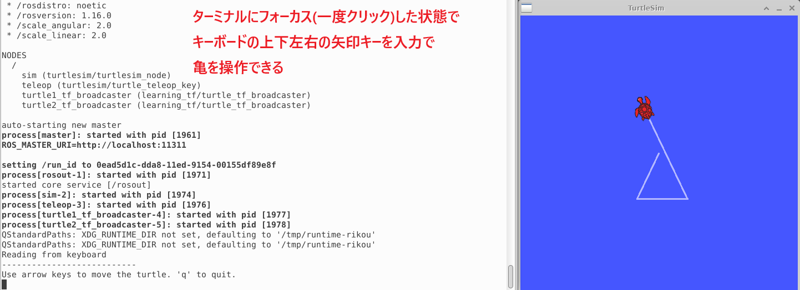
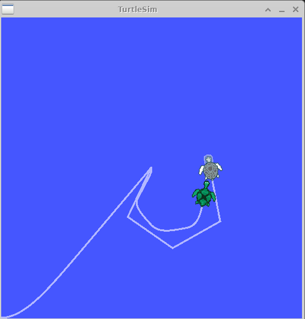
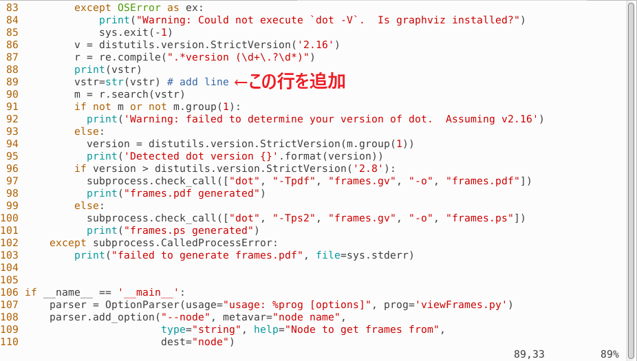
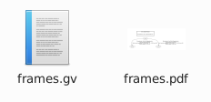
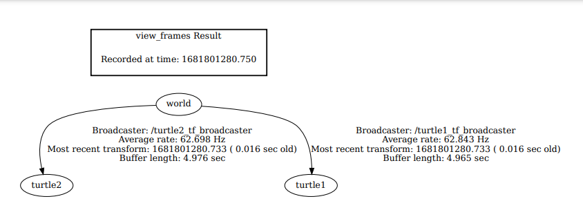

# 3-2：tfのbroadcasterとlistener(C++)
[前ページ(3-1：tfとフレームの概要](./3-01.md)　｜　[目次へ戻る](../index.md)　｜　[次ページ(3-3：フレームの追加(C++))](./3-03.md)
- - -
ここではtfのbroadcasterとlistenerのC++での書き方を説明します。

## tf学習用パッケージの作成

まずは作業用パッケージを作成します。

ROSのワークディレクトリの「src」ディレクトリに移動して、以下のコマンドでパッケージを作成します。

~~~shell
catkin_create_pkg learning_tf tf roscpp rospy turtlesim
~~~

依存関係にある「tf」はtfを扱うためのパッケージで、「turtlesim」はサンプルとして扱う亀のパッケージです。

パッケージが作成できたら、そのパッケージをビルドします。

~~~shell
catkin build learning_tf
~~~

エラーなくビルドができたらbroadcasterを作成していきます。

## tf broadcaster(C++)

「learning_tf」パッケージ内の「src」ディレクトリ内に以下のファイルを作成します。

・turtle_tf_broadcaster.cpp
~~~c++
#include <ros/ros.h>
#include <tf/transform_broadcaster.h> // tfのBroadcasterを使うヘッダーファイル読み込み
#include <turtlesim/Pose.h>           // turtlesimで使われるPoseメッセージファイルを読み込み

/**
 * turtleのtfをbroadcastするサンプル(C++)
 */

std::string turtle_name; // 亀の名前を保持する変数

// Subscribeした時のコールバック関数
void poseCallback(const turtlesim::PoseConstPtr& msg){
  // Broadcaster
  static tf::TransformBroadcaster br;

  // tfの3次元座標を作成
  tf::Transform transform;
  transform.setOrigin( tf::Vector3(msg->x, msg->y, 0.0) );

  // tfの姿勢座標を作成
  tf::Quaternion q;
  q.setRPY(0, 0, msg->theta);
  transform.setRotation(q);

  // worldフレームにtfを配信
  // 「ros::Time::now()」でタイムスタンプとして現在のROSの時間を設定
  // 親フレーム：world、子フレーム：変数turtle_nameの値
  br.sendTransform(tf::StampedTransform(transform, ros::Time::now(), "world", turtle_name));
}

// メイン関数
int main(int argc, char** argv){
  // ノード名「my_tf_broadcaster」
  ros::init(argc, argv, "my_tf_broadcaster");

  // 引数チェック
  if (argc != 2) { ROS_ERROR("need turtle name as argument"); return -1; };

  // 引数の1つ目を亀の名前にする
  turtle_name = argv[1];

  // 「亀の名前/pose」のトピックをSubscribe
  ros::NodeHandle node;
  ros::Subscriber sub = node.subscribe(turtle_name+"/pose", 10, &poseCallback);

  ros::spin();
  return 0;
};
~~~

ソースコードのコメントを読めば大体やっていることは理解できると思います。

broadcasterのソースファイルができたら「CmakeLists.txt」に以下の記述を追記します。

・CmakeLists.txt
~~~cmake
add_executable(turtle_tf_broadcaster src/turtle_tf_broadcaster.cpp)
target_link_libraries(turtle_tf_broadcaster ${catkin_LIBRARIES})
~~~

次に「learning_tf」パッケージ内に「launch」ファイルを作成し、その中に以下のファイルを作成します。

・start_demo.launch
~~~xml
<launch>

  <!-- Turtlesimのノード-->
  <node pkg="turtlesim" type="turtlesim_node" name="sim"/>

  <!-- 亀をキーボードで操作するためのノード -->
  <node pkg="turtlesim" type="turtle_teleop_key" name="teleop" output="screen"/>

  <!-- 設定値 -->
  <param name="scale_linear"  value="2" type="double"/>
  <param name="scale_angular" value="2" type="double"/>

  <!-- 作成したtf broadcasterのノード -->
  <node pkg="learning_tf" type="turtle_tf_broadcaster" args="/turtle1" name="turtle1_tf_broadcaster" />
  <node pkg="learning_tf" type="turtle_tf_broadcaster" args="/turtle2" name="turtle2_tf_broadcaster" />

</launch>
~~~

ここまでできたらパッケージをビルドします。

~~~shell
catkin build learning_tf
~~~

ビルドした後、おまじないを実行しておきます。これをしておかないと、新たにビルドしたパッケージが認識されずにエラーになる場合があります。

~~~shell
source /opt/ros/noetic/setup.bash
source ~/catkin_ws/devel/setup.bash
~~~

おまじないを実行したターミナルにおいて、以下のコマンドでlaunchファイルを実行します。

~~~shell
roslaunch learning_tf start_demo.launch
~~~

エラーなく実行できると、以下のように亀が1匹だけ表示されます(表示される亀の色などはランダムなので同一の亀が表示されるとは限らないので注意してください)。

この亀自体をGUIで表示させているのが、launchファイルで呼び出している「Turtlesimのノード」の部分です。

またlaunchファイルを起動させたターミナルにフォーカスを合わせた状態でキーボードの上下左右の矢印キーを入力すると、以下のように亀を操作することができます。

この亀の操作をできるようにしているのは、launchファイルで呼び出している「亀をキーボードで操作するためのノード」の部分です。

終了させる場合は「Ctrl + C」を連打して終了させます。

また、この亀のGUIが表示されている状態で別のターミナルを開き、以下のコマンドを実行することでtfがbroadcastできているか確認できます。

~~~shell
rosrun tf tf_echo /[親フレーム] /[子フレーム]
~~~

実際に実行すると、以下のような結果が表示されるはずです。

~~~shell
$ rosrun tf tf_echo /world /turtle1

At time 1681796201.904
- Translation: [4.956, 7.364, 0.000]
- Rotation: in Quaternion [0.000, 0.000, 0.846, 0.534]
            in RPY (radian) [0.000, -0.000, 2.016]
            in RPY (degree) [0.000, -0.000, 115.508]
At time 1681796202.686
- Translation: [4.956, 7.364, 0.000]
- Rotation: in Quaternion [0.000, 0.000, 0.846, 0.534]
            in RPY (radian) [0.000, -0.000, 2.016]
            in RPY (degree) [0.000, -0.000, 115.508]
~~~

このコマンドも「Ctrl + C」を連打して終了させます。

これでbroadcaster部分ができたので、listener部分を作成していきます。

## tf listener(C++)

「learning_tf」パッケージ内の「src」ディレクトリ内に以下のファイルを作成します。

・turtle_tf_listener.cpp
~~~c++
#include <ros/ros.h>
#include <tf/transform_listener.h> // tfのListenerを使うヘッダーファイル読み込み
#include <geometry_msgs/Twist.h>   // Twistメッセージファイルを読み込み
#include <turtlesim/Spawn.h>       // turtlesimで使われるSpawnサービスファイルを読み込み

/**
 * turtleのtfをlistenするサンプル(C++)
 */

int main(int argc, char** argv){
  // ノード名「my_tf_listener」
  ros::init(argc, argv, "my_tf_listener");
  ros::NodeHandle node;

  // spawnサービスを実行
  ros::service::waitForService("spawn");
  ros::ServiceClient add_turtle = node.serviceClient<turtlesim::Spawn>("spawn");
  turtlesim::Spawn srv;
  add_turtle.call(srv);

  // Publishの設定
  // トピック「turtle2/cmd_vel」、Twist型
  ros::Publisher turtle_vel = node.advertise<geometry_msgs::Twist>("turtle2/cmd_vel", 10);

  // Listener
  // tfのlistenerはループ内で毎回定義すると失敗するので必ずループ外に記述。
  // 基本的にはクラス変数として定義して使うのが良い。
  // 一旦listenerが作成されると10秒間バッファに貯める。
  tf::TransformListener listener;

  ros::Rate rate(10.0); // 10Hz

  // ROSが起動している限り無限ループ
  while (node.ok()){
    // タイムスタンプを持つtf
    tf::StampedTransform transform;
    try {
      // tfを受信
      // 変換ベースフレーム(from):turtle2, 変換対象フレーム(to):turtle1, ros::Time(0)で常に最新のtfを取得, 結果格納オブジェクト
      listener.lookupTransform("/turtle2", "/turtle1", ros::Time(0), transform);
    } catch (tf::TransformException &ex) {
      ROS_ERROR("%s",ex.what());
      ros::Duration(1.0).sleep();
      continue;
    }

    // 取得したtfを元にPublishする内容を設定
    geometry_msgs::Twist vel_msg;
    vel_msg.angular.z = 4.0 * atan2(transform.getOrigin().y(), transform.getOrigin().x());
    vel_msg.linear.x  = 0.5 * sqrt(pow(transform.getOrigin().x(), 2) + pow(transform.getOrigin().y(), 2));
    
    // Publish実行
    turtle_vel.publish(vel_msg);

    rate.sleep();
  }
  return 0;
};
~~~

listenerもソースコードのコメントを読めば大体やっていることは理解できると思います。

listenerのソースファイルができたら「CmakeLists.txt」に以下の記述を追記します。

・CmakeLists.txt
~~~cmake
add_executable(turtle_tf_listener src/turtle_tf_listener.cpp)
target_link_libraries(turtle_tf_listener ${catkin_LIBRARIES})
~~~

次に「start_demo.launch」に以下のtf listenerの行を追加します。

~~~xml
<node pkg="learning_tf" type="turtle_tf_listener" name="listener" />
~~~

・start_demo.launch
~~~xml
<launch>

  <!-- Turtlesimのノード-->
  <node pkg="turtlesim" type="turtlesim_node" name="sim"/>

  <!-- 亀をキーボードで操作するためのノード -->
  <node pkg="turtlesim" type="turtle_teleop_key" name="teleop" output="screen"/>

  <!-- 設定値 -->
  <param name="scale_linear"  value="2" type="double"/>
  <param name="scale_angular" value="2" type="double"/>

  <!-- 作成したtf broadcasterのノード -->
  <node pkg="learning_tf" type="turtle_tf_broadcaster" args="/turtle1" name="turtle1_tf_broadcaster" />
  <node pkg="learning_tf" type="turtle_tf_broadcaster" args="/turtle2" name="turtle2_tf_broadcaster" />

  <!-- 作成したtf listenerのノード(追加) -->
  <node pkg="learning_tf" type="turtle_tf_listener" name="listener" />

</launch>
~~~

ここまでできたらパッケージをビルドします。

~~~shell
catkin build learning_tf
~~~

エラーなくビルドができたら、おまじないを実行したターミナルにおいて、以下のコマンドでlaunchファイルを実行します。

~~~shell
roslaunch learning_tf start_demo.launch
~~~

実行すると以下のように2匹目の亀が出現し、自分が操作する亀を追いかけるような形になります。

launchファイル起動時に以下のようなエラーが出る場合があります。

~~~shell
[ERROR] [1681799494.125513857]: "turtle2" passed to lookupTransform argument target_frame does not exist. 
~~~

これは起動時にtfのフレームがbroadcastするのに少し時間がかかるため、まだtfのデータが来ていないのにlookupTransformを実行しているためこのようなエラーが出ています。

## フレーム関係をpdfで出力する

以下のコマンドでframeの親子関係などをpdf化してコマンドを叩いた場所に保存することができます。
~~~shell
rosrun tf view_frames
~~~

このコマンドを実行して以下のようなエラーが出る場合もあります。
~~~shell
$ rosrun tf view_frames

Listening to /tf for 5.0 seconds
Done Listening
b'dot - graphviz version 2.43.0 (0)\n'
Traceback (most recent call last):
  File "/opt/ros/noetic/lib/tf/view_frames", line 119, in <module>
    generate(dot_graph)
  File "/opt/ros/noetic/lib/tf/view_frames", line 89, in generate
    m = r.search(vstr)
TypeError: cannot use a string pattern on a bytes-like object
~~~

その場合は以下のようにします。

以下のコマンドでファイルを開きます。エディタはなんでもかまいません。

~~~shell
sudo vi /opt/ros/noetic/lib/tf/view_frames
~~~

ファイルを開いた後、viであれば「:set number」と入力して行数を表示させます。

89行目あたりにある「m = r.search(vstr)」という記述の前に「vstr=str(vstr)」を一行追加して上書保存します。

~~~python
vstr=str(vstr) # add line
m = r.search(vstr)
~~~

実際に追加すると以下のようになります。

追加した後「start_demo.launch」を起動させた状態でrosrun tf view_framesを実行すると、エラーなく以下のような表示が出て終了します。

~~~shell
$ rosrun tf view_frames
Listening to /tf for 5.0 seconds
Done Listening
b'dot - graphviz version 2.43.0 (0)\n'
Detected dot version 2.43
frames.pdf generated
~~~

終了後、コマンドを実行したディレクトリに行くと以下のように2つのファイルができています。gvファイルはいらないので削除しても構いません。

作成されたpdfファイルを開くと、以下のように各フレーム間の繋がりが図として確認できます。

今回の結果ではworldフレームの子としてturtle1とturtle2が存在しているという形になっています。

各フレームや木構造などが図としてわかりやすくなっているので、このコマンドは良く使うことになるかと思います。

次ページでは新たなフレームをC++のソースコードに追加していきます。

- - -
[前ページ(3-1：tfとフレームの概要](./3-01.md)　｜　[目次へ戻る](../index.md)　｜　[次ページ(3-3：フレームの追加(C++))](./3-03.md)
- - -