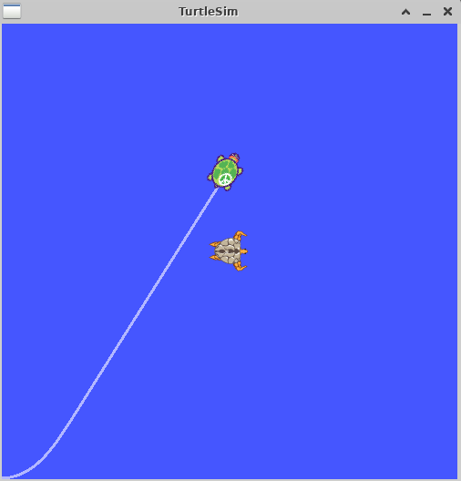

# 3-3：フレームの追加(C++)
[前ページ(3-2：tfのbroadcasterとlistener(C++)](./3-02.md)　｜　[目次へ戻る](../index.md)　｜　[次ページ(3-4：tfの時間(C++))](./3-04.md)
- - -
ここではフレームをC++のソースコードに追加する方法を説明します。

## フレームをどこに追加するか

「[3-1：tfとフレームの概要](./3-01.md)」で説明したように、フレームには以下のルールがあります。

- 子フレームは複数登録できる
- 親フレームは1つしか登録できない
- ループ構造にはできない

そして前ページまでの状態としてフレームは以下のようになっています。

なので、turtle1もturtle2も親がworldになっているため、これ以上親を登録することはできません。またworldは全体の基準となる座標系と想定しているため、worldの親は登録できません。

今回は木構造も考えるようにするため、turtle1を親とするフレームを追加します。

## 静的(相対位置が変わらない)フレーム追加(C++)

「learning_tf」パッケージ内の「src」ディレクトリ内に以下のファイルを作成します。

・frame_tf_broadcaster.cpp
~~~c++
#include <ros/ros.h>
#include <tf/transform_broadcaster.h>

/**
 * フレームを追加するC++のサンプル
 */

int main(int argc, char** argv){
  // ノード名「my_tf_frame_broadcaster」
  ros::init(argc, argv, "my_tf_frame_broadcaster");
  ros::NodeHandle node;

  // Broadcasterとtransform
  tf::TransformBroadcaster br;
  tf::Transform transform;

  ros::Rate rate(10.0); // 10Hz

  // ROSが起動している限り無限ループ
  while (node.ok()){
    // tramsformの設定
    transform.setOrigin( tf::Vector3(0.0, 2.0, 0.0) );
    transform.setRotation( tf::Quaternion(0, 0, 0, 1) );

    // turtle1を親とするcarrot1フレームを作成して送信
    // 送信するtramsformの設定にあるように、turtle1のy軸方向に2移動した場所にcarrot1の基準点が作成されている
    br.sendTransform(tf::StampedTransform(transform, ros::Time::now(), "turtle1", "carrot1"));
    rate.sleep();
  }

  return 0;
};
~~~

turtle_tf_listener.cppの一部を書き換えた「turtle_tf_frame_listener.cpp」を作成します。

・turtle_tf_frame_listener.cpp
~~~c++
#include <ros/ros.h>
#include <tf/transform_listener.h> // tfのListenerを使うヘッダーファイル読み込み
#include <geometry_msgs/Twist.h>   // Twistメッセージファイルを読み込み
#include <turtlesim/Spawn.h>       // turtlesimで使われるSpawnサービスファイルを読み込み

/**
 * turtleの追加フレームをlistenするサンプル2(C++)
 */

int main(int argc, char** argv){
  // ノード名「my_tf_frame_listener」
  ros::init(argc, argv, "my_tf_frame_listener");
  ros::NodeHandle node;

  // spawnサービスを実行
  ros::service::waitForService("spawn");
  ros::ServiceClient add_turtle = node.serviceClient<turtlesim::Spawn>("spawn");
  turtlesim::Spawn srv;
  add_turtle.call(srv);

  // Publishの設定
  // トピック「turtle2/cmd_vel」、Twist型
  ros::Publisher turtle_vel = node.advertise<geometry_msgs::Twist>("turtle2/cmd_vel", 10);

  // Listener
  // tfのlistenerはループ内で毎回定義すると失敗するので必ずループ外に記述。
  // 基本的にはクラス変数として定義して使うのが良い。
  // 一旦listenerが作成されると10秒間バッファに貯める。
  tf::TransformListener listener;

  ros::Rate rate(10.0); // 10Hz

  // ROSが起動している限り無限ループ
  while (node.ok()){
    // タイムスタンプを持つtf
    tf::StampedTransform transform;
    try {
      // tfを受信
      // 変換ベースフレーム(from):turtle2, 変換対象フレーム(to):carrot1, ros::Time(0)で常に最新のtfを取得, 結果格納オブジェクト
      listener.lookupTransform("/turtle2", "/carrot1", ros::Time(0), transform);
    } catch (tf::TransformException &ex) {
      ROS_ERROR("%s",ex.what());
      ros::Duration(1.0).sleep();
      continue;
    }

    // 取得したtfを元にPublishする内容を設定
    geometry_msgs::Twist vel_msg;
    vel_msg.angular.z = 4.0 * atan2(transform.getOrigin().y(), transform.getOrigin().x());
    vel_msg.linear.x  = 0.5 * sqrt(pow(transform.getOrigin().x(), 2) + pow(transform.getOrigin().y(), 2));
    
    // Publish実行
    turtle_vel.publish(vel_msg);

    rate.sleep();
  }
  return 0;
};
~~~

書き換えている部分は以下の2つです。

- ノード名を「my_tf_frame_listener」に変更
- lookupTransformでtoのフレームを「carrot1」に変更

ソースファイルができたら「CmakeLists.txt」に以下の記述を追記します。

・CmakeLists.txt
~~~cmake
# frame_tf_broadcaster.cpp
add_executable(frame_tf_broadcaster src/frame_tf_broadcaster.cpp)
target_link_libraries(frame_tf_broadcaster ${catkin_LIBRARIES})

# turtle_tf_frame_listener.cpp
add_executable(turtle_tf_frame_listener src/turtle_tf_frame_listener.cpp)
target_link_libraries(turtle_tf_frame_listener ${catkin_LIBRARIES})
~~~

次に「start_demo.launch」を一部変更した「start_demo2.launch」を作成します。

・start_demo2.launch
~~~xml
<launch>

  <!-- Turtlesimのノード-->
  <node pkg="turtlesim" type="turtlesim_node" name="sim"/>

  <!-- 亀をキーボードで操作するためのノード -->
  <node pkg="turtlesim" type="turtle_teleop_key" name="teleop" output="screen"/>

  <!-- 設定値 -->
  <param name="scale_linear"  value="2" type="double"/>
  <param name="scale_angular" value="2" type="double"/>

  <!-- 作成したtf broadcasterのノード -->
  <node pkg="learning_tf" type="turtle_tf_broadcaster" args="/turtle1" name="turtle1_tf_broadcaster" />
  <node pkg="learning_tf" type="turtle_tf_broadcaster" args="/turtle2" name="turtle2_tf_broadcaster" />

  <!-- 作成したtf listenerのノード(typeで呼び出す実行ファイルを変更) -->
  <node pkg="learning_tf" type="turtle_tf_frame_listener" name="listener" />

  <!-- 作成したフレーム追加のノード(追加) -->
  <node pkg="learning_tf" type="frame_tf_broadcaster" name="broadcaster_frame" />

</launch>
~~~

変更部分は以下の2つです。

- tf listenerのノードのtypeを「turtle_tf_frame_listener」に変更
- 作成したフレーム追加のノードを追加

ここまでできたらパッケージをビルドします。

~~~shell
catkin build learning_tf
~~~

エラーなくビルドができたら、おまじないを実行したターミナルにおいて、以下のコマンドでlaunchファイルを実行します。

~~~shell
roslaunch learning_tf start_demo2.launch
~~~

実行すると、今までは2匹目の亀が中心にいる亀と同じ位置で止まるような形でしたが、中心の亀の左側(y軸側)に少しずれた位置で停止するようになります。

亀を操作して動き回っても、この2匹目の亀が停止する位置関係は変わりません。

## 動的(相対位置が変わる)フレーム追加(C++)

次に時間で位置関係が変化するようなフレームを追加します。

「learning_tf」パッケージ内の「src」ディレクトリ内にframe_tf_broadcaster.cppの一部を書き換えた「frame_tf_broadcaster2.cpp」を作成します。

・frame_tf_broadcaster2.cpp
~~~c++
#include <ros/ros.h>
#include <tf/transform_broadcaster.h>

/**
 * フレームを追加するC++のサンプル2
 */

int main(int argc, char** argv){
  // ノード名「my_tf_frame2_broadcaster」
  ros::init(argc, argv, "my_tf_frame2_broadcaster");
  ros::NodeHandle node;

  // Broadcasterとtransform
  tf::TransformBroadcaster br;
  tf::Transform transform;

  ros::Rate rate(10.0); // 10Hz

  // ROSが起動している限り無限ループ
  while (node.ok()){
    // tramsformの設定
    // 時間によって直径2の円周上を移動
    transform.setOrigin( tf::Vector3(2.0*sin(ros::Time::now().toSec()), 2.0*cos(ros::Time::now().toSec()), 0.0) );
    transform.setRotation( tf::Quaternion(0, 0, 0, 1) );

    // turtle1を親とするcarrot1フレームを作成して送信
    // 送信するtramsformの設定にあるように、turtle1を中心とした円周上をcarrot1の基準点が移動
    br.sendTransform(tf::StampedTransform(transform, ros::Time::now(), "turtle1", "carrot1"));
    rate.sleep();
  }

  return 0;
};
~~~

変更部分は以下の2つです。

- ノード名を「my_tf_frame2_broadcaster」に変更
- transform.setOriginのところで直径2の円周上を移動するように変更

ソースファイルができたら「CmakeLists.txt」に以下の記述を追記します。

・CmakeLists.txt
~~~cmake
# frame_tf_broadcaster2.cpp
add_executable(frame_tf_broadcaster2 src/frame_tf_broadcaster2.cpp)
target_link_libraries(frame_tf_broadcaster2 ${catkin_LIBRARIES})
~~~

次に「start_demo2.launch」を一部変更した「start_demo3.launch」を作成します。

・start_demo3.launch
~~~xml
<launch>

  <!-- Turtlesimのノード-->
  <node pkg="turtlesim" type="turtlesim_node" name="sim"/>

  <!-- 亀をキーボードで操作するためのノード -->
  <node pkg="turtlesim" type="turtle_teleop_key" name="teleop" output="screen"/>

  <!-- 設定値 -->
  <param name="scale_linear"  value="2" type="double"/>
  <param name="scale_angular" value="2" type="double"/>

  <!-- 作成したtf broadcasterのノード -->
  <node pkg="learning_tf" type="turtle_tf_broadcaster" args="/turtle1" name="turtle1_tf_broadcaster" />
  <node pkg="learning_tf" type="turtle_tf_broadcaster" args="/turtle2" name="turtle2_tf_broadcaster" />

  <!-- 作成したtf listenerのノード -->
  <node pkg="learning_tf" type="turtle_tf_frame_listener" name="listener" />

  <!-- 作成したフレーム追加のノード(typeをframe_tf_broadcaster2に変更) -->
  <node pkg="learning_tf" type="frame_tf_broadcaster2" name="broadcaster_frame" />

</launch>
~~~

変更部分は以下の1つです。

- フレーム追加のノードのtypeを「frame_tf_broadcaster2」に変更

ここまでできたらパッケージをビルドします。

~~~shell
catkin build learning_tf
~~~

エラーなくビルドができたら、おまじないを実行したターミナルにおいて、以下のコマンドでlaunchファイルを実行します。

~~~shell
roslaunch learning_tf start_demo3.launch
~~~

実行すると以下のように2匹目の亀が1匹目の亀の周囲をぐるぐると移動するようになります。

また「start_demo3.launch」を実行している時に以下のコマンドを実行すると、ちゃんとturtle1を親とする「carrot1」のフレームが追加されていることがわかります。

~~~shell
rosrun tf view_frames
~~~

次のページではtfの時間について説明します。

- - -
[前ページ(3-2：tfのbroadcasterとlistener(C++)](./3-02.md)　｜　[目次へ戻る](../index.md)　｜　[次ページ(3-4：tfの時間(C++))](./3-04.md)
- - -