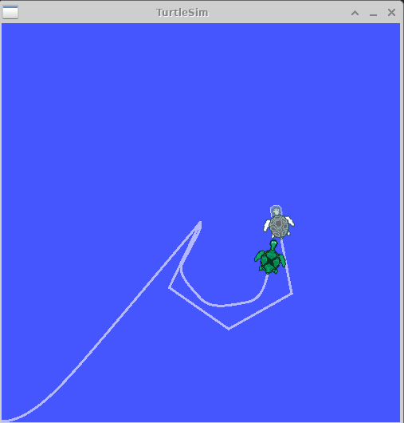

# 3-5：tfのbroadcasterとlistener(python)
[前ページ(3-4：tfの時間(C++)](./3-04.md)　｜　[目次へ戻る](../index.md)　｜　[次ページ(3-6：フレームの追加(python))](./3-06.md)
- - -
ここではtfのbroadcasterとlistenerのpythonでの書き方を説明します。

挙動などの細かい説明は「[3-2：tfのbroadcasterとlistener(C++)](./3-02.md)」で既に記述しているのでそちらを参照してください。

## tf broadcaster(python)

「learning_tf」パッケージ内に「scripts」ディレクトリを作成し、その中に以下のファイルを作成します。

・turtle_tf_broadcaster.py
~~~python
#!/usr/bin/python3
import roslib
roslib.load_manifest('learning_tf')
import rospy

import tf
import turtlesim.msg

"""
turtleのtfをbroadcastするサンプル(python)
"""

# Subscribeした際のコールバック関数
def handle_turtle_pose(msg, turtlename):
  # Broadcaster
  br = tf.TransformBroadcaster()

  # eulerからquaternionを作成
  q = tf.transformations.quaternion_from_euler(0, 0, msg.theta)

  # worldフレームにtfを配信
  # 「rospy.Time.now()」でタイムスタンプとして現在のROSの時間を設定
  # 親フレーム：world、子フレーム：変数turtlenameの値
  br.sendTransform((msg.x, msg.y, 0), q, rospy.Time.now(), turtlename, "world")

if __name__ == '__main__':
  # ノード名「turtle_tf_broadcaster」
  rospy.init_node('turtle_tf_broadcaster')

  # 引数「turtle」の値を取得
  turtlename = rospy.get_param('~turtle')

  # turtleのPoseを取得してコールバック関数である「handle_turtle_pose」を実行
  rospy.Subscriber('/%s/pose' % turtlename, turtlesim.msg.Pose, handle_turtle_pose, turtlename)
  rospy.spin()
~~~

挙動としてはC++の時と同じなので割愛します。

## tf listener(python)

「learning_tf」パッケージ内の「scripts」ディレクトリ内に以下のファイルを作成します。

・turtle_tf_listener.py
~~~python
#!/usr/bin/python3
import roslib
roslib.load_manifest('learning_tf')
import rospy
import math
import tf
import geometry_msgs.msg
import turtlesim.srv

"""
turtleのtfをlistenするサンプル(python)
"""

if __name__ == '__main__':
  # ノード名「tf_turtle」
  rospy.init_node('tf_turtle')

  # spawnサービスを実行
  rospy.wait_for_service('spawn')
  spawner = rospy.ServiceProxy('spawn', turtlesim.srv.Spawn)
  spawner(4, 2, 0, 'turtle2')

  # Publishの設定
  # トピック「turtle2/cmd_vel」、Twist型
  turtle_vel = rospy.Publisher('turtle2/cmd_vel', geometry_msgs.msg.Twist, queue_size=10)

  # Listener
  # tfのlistenerはループ内で毎回定義すると失敗するので必ずループ外に記述。
  # 基本的にはクラス変数として定義して使うのが良い。
  # 一旦listenerが作成されると10秒間バッファに貯める。
  listener = tf.TransformListener()

  rate = rospy.Rate(10.0) # 10Hz

  # ROSが起動している限り無限ループ
  while not rospy.is_shutdown():
    try:
      # tfを受信
      # 変換ベースフレーム(from):turtle2, 変換対象フレーム(to):turtle1, rospy.Time(0)で常に最新のtfを取得
      (trans, rot) = listener.lookupTransform('/turtle2', '/turtle1', rospy.Time(0))
    except (tf.LookupException, tf.ConnectivityException, tf.ExtrapolationException):
      continue

    # 取得したtfを元にPublishする内容を設定
    angular = 4 * math.atan2(trans[1], trans[0])
    linear = 0.5 * math.sqrt(trans[0] ** 2 + trans[1] ** 2)
    cmd = geometry_msgs.msg.Twist()
    cmd.linear.x = linear
    cmd.angular.z = angular

    # Publish実行
    turtle_vel.publish(cmd)

    rate.sleep()
~~~

こちらも挙動はC++の時と同じです。

ソースファイルができたら、「scripts」ディレクトリに移動して以下のコマンドを実行してファイルに実行権限を付与します。

~~~shell
chmod +x *
~~~

次に「launch」ディレクトリに以下のファイルを作成します。

・start_demo_python.launch
~~~xml
<launch>

  <!-- Turtlesimのノード-->
  <node pkg="turtlesim" type="turtlesim_node" name="sim"/>

  <!-- 亀をキーボードで操作するためのノード -->
  <node pkg="turtlesim" type="turtle_teleop_key" name="teleop" output="screen"/>

  <!-- 作成したtf broadcasterのノード -->
  <node name="turtle1_tf_broadcaster" pkg="learning_tf" type="turtle_tf_broadcaster.py" respawn="false" output="screen" >
    <!-- 設定値 -->
    <param name="turtle" type="string" value="turtle1" />
  </node>
  <node name="turtle2_tf_broadcaster" pkg="learning_tf" type="turtle_tf_broadcaster.py" respawn="false" output="screen" >
    <!-- 設定値 -->
    <param name="turtle" type="string" value="turtle2" /> 
  </node>

  <!-- 作成したtf listenerのノード -->
  <node pkg="learning_tf" type="turtle_tf_listener.py" name="listener" />

</launch>
~~~

こちらもC++の時と同じ結果になるように記述しています。

ここまで出来たら、おまじないを実行したターミナルにおいて、以下のコマンドでlaunchファイルを実行します。

~~~shell
roslaunch learning_tf start_demo_python.launch
~~~

実行するとC++の時と同じように2匹目の亀が出現し、自分が操作する亀を追いかけるような形になります。

launchファイル起動時に以下のようなエラーが出る場合があります。

~~~shell
[WARN] [1681970129.941020]: Inbound TCP/IP connection failed: connection from sender terminated before handshake header received. 0 bytes were received. Please check sender for additional details.
~~~

これもC++の時と同様に、起動時にtfのフレームがbroadcastするのに少し時間がかかるため、まだtfのデータが来ていないのにlookupTransformを実行しているためこのようなエラーが出ています。

## フレーム関係をpdfで出力して確認

以下のコマンドでframeの親子関係などをpdf化して確認します。
~~~shell
rosrun tf view_frames
~~~

作成されたpdfの中身もC++の時と同様の結果になっていることがわかります。

次ページでは新たなフレームをpythonのソースコードに追加していきます。

- - -
[前ページ(3-4：tfの時間(C++)](./3-04.md)　｜　[目次へ戻る](../index.md)　｜　[次ページ(3-6：フレームの追加(python))](./3-06.md)
- - -