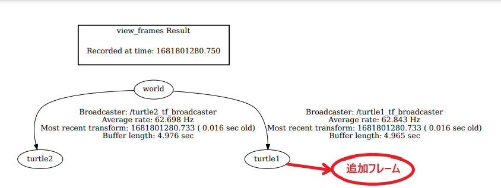
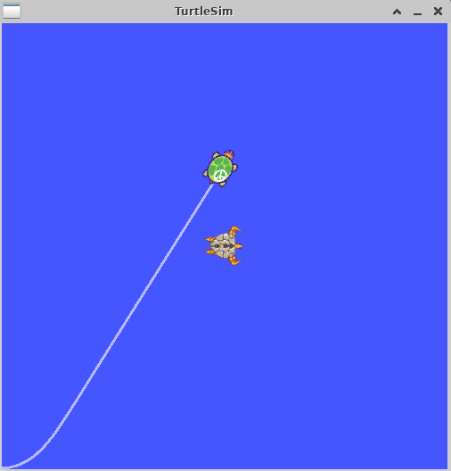
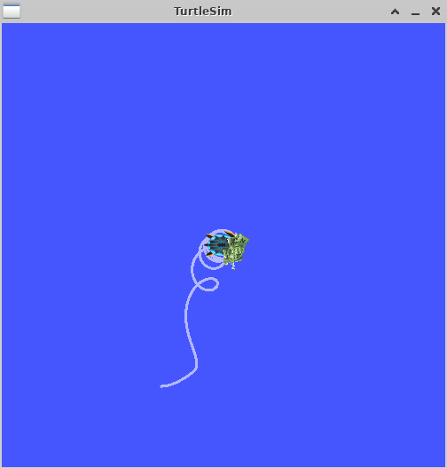
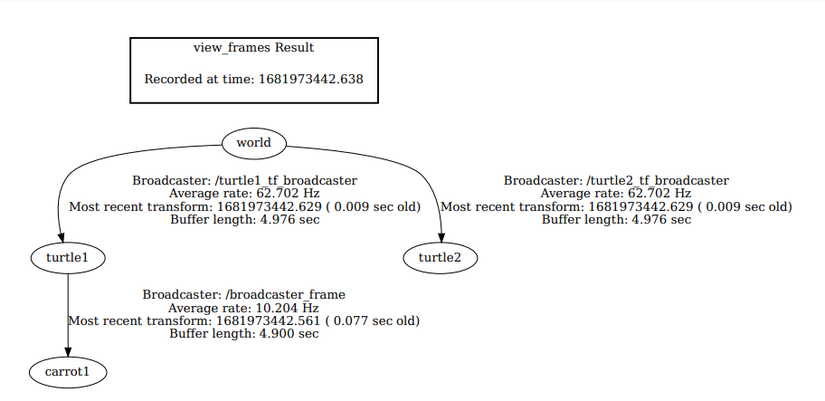

# 3-6：フレームの追加(python)
[前ページ(3-5：tfのbroadcasterとlistener(python))](./3-05.md)　｜　[目次へ戻る](../index.md)　｜　[次ページ(3-7：tfの時間(python))](./3-07.md)
- - -
ここではフレームをpythonのソースコードに追加する方法を説明します。

挙動などの細かい説明は「[3-3：フレームの追加(C++)](./3-03.md)」で既に記述しているのでそちらを参照してください。

## フレームをどこに追加するか

C++の時と同様に、turtle1を親とするフレームを追加します。

## 静的(相対位置が変わらない)フレーム追加(python)

「learning_tf」パッケージ内の「scripts」ディレクトリ内に以下のファイルを作成します。

・frame_tf_broadcaster.py
~~~python
#!/usr/bin/python3
import roslib
roslib.load_manifest('learning_tf')

import rospy
import tf

"""
フレームを追加するサンプル(python)
"""

if __name__ == '__main__':
  # ノード名「my_tf_frame_broadcaster」
  rospy.init_node('my_tf_frame_broadcaster')

  # Broadcaster
  br = tf.TransformBroadcaster()

  rate = rospy.Rate(10.0) # 10Hz

  # ROSが起動している限り無限ループ
  while not rospy.is_shutdown():
    # turtle1を親とするcarrot1フレームを作成して送信
    # turtle1のy軸方向に2移動した場所にcarrot1の基準点が作成されている
    br.sendTransform((0.0, 2.0, 0.0), (0.0, 0.0, 0.0, 1.0), rospy.Time.now(), "carrot1", "turtle1")
    rate.sleep()
~~~

turtle_tf_listener.pyの一部を書き換えた「turtle_tf_frame_listener.py」を作成します。

・turtle_tf_frame_listener.py
~~~python
#!/usr/bin/python3
import roslib
roslib.load_manifest('learning_tf')
import rospy
import math
import tf
import geometry_msgs.msg
import turtlesim.srv

"""
turtleのtfをlistenするサンプル2(python)
"""

if __name__ == '__main__':
  # ノード名「tf_turtle_frame」
  rospy.init_node('tf_turtle_frame')

  # spawnサービスを実行
  rospy.wait_for_service('spawn')
  spawner = rospy.ServiceProxy('spawn', turtlesim.srv.Spawn)
  spawner(4, 2, 0, 'turtle2')

  # Publishの設定
  # トピック「turtle2/cmd_vel」、Twist型
  turtle_vel = rospy.Publisher('turtle2/cmd_vel', geometry_msgs.msg.Twist, queue_size=10)

  # Listener
  # tfのlistenerはループ内で毎回定義すると失敗するので必ずループ外に記述。
  # 基本的にはクラス変数として定義して使うのが良い。
  # 一旦listenerが作成されると10秒間バッファに貯める。
  listener = tf.TransformListener()

  rate = rospy.Rate(10.0) # 10Hz

  # ROSが起動している限り無限ループ
  while not rospy.is_shutdown():
    try:
      # tfを受信
      # 変換ベースフレーム(from):turtle2, 変換対象フレーム(to):carrot1, rospy.Time(0)で常に最新のtfを取得
      (trans, rot) = listener.lookupTransform('/turtle2', '/carrot1', rospy.Time(0))
    except (tf.LookupException, tf.ConnectivityException, tf.ExtrapolationException):
      continue

    # 取得したtfを元にPublishする内容を設定
    angular = 4 * math.atan2(trans[1], trans[0])
    linear = 0.5 * math.sqrt(trans[0] ** 2 + trans[1] ** 2)
    cmd = geometry_msgs.msg.Twist()
    cmd.linear.x = linear
    cmd.angular.z = angular

    # Publish実行
    turtle_vel.publish(cmd)

    rate.sleep()
~~~

ソースファイルができたら、「scripts」ディレクトリに移動して以下のコマンドを実行してファイルに実行権限を付与します。

~~~shell
chmod +x *
~~~

次に「start_demo_python.launch」を一部変更した「start_demo2_python.launch」を作成します。

・start_demo2_python.launch
~~~xml
<launch>

  <!-- Turtlesimのノード-->
  <node pkg="turtlesim" type="turtlesim_node" name="sim"/>

  <!-- 亀をキーボードで操作するためのノード -->
  <node pkg="turtlesim" type="turtle_teleop_key" name="teleop" output="screen"/>

  <!-- 作成したtf broadcasterのノード -->
  <node name="turtle1_tf_broadcaster" pkg="learning_tf" type="turtle_tf_broadcaster.py" respawn="false" output="screen" >
    <!-- 設定値 -->
    <param name="turtle" type="string" value="turtle1" />
  </node>
  <node name="turtle2_tf_broadcaster" pkg="learning_tf" type="turtle_tf_broadcaster.py" respawn="false" output="screen" >
    <!-- 設定値 -->
    <param name="turtle" type="string" value="turtle2" /> 
  </node>

  <!-- 作成したtf listenerのノード(typeで呼び出す実行ファイルを変更) -->
  <node pkg="learning_tf" type="turtle_tf_frame_listener.py" name="listener" />

  <!-- 作成したフレーム追加のノード(追加) -->
  <node pkg="learning_tf" type="frame_tf_broadcaster.py" name="broadcaster_frame" />

</launch>
~~~

おまじないを実行したターミナルにおいて、以下のコマンドでlaunchファイルを実行します。

~~~shell
roslaunch learning_tf start_demo2_python.launch
~~~

実行すると、C++の時と同様に、中心の亀の左側(y軸側)に少しずれた位置で停止するようになります。

## 動的(相対位置が変わる)フレーム追加(python)

次に時間で位置関係が変化するようなフレームを追加します。

「learning_tf」パッケージ内の「src」ディレクトリ内にframe_tf_broadcaster.pyの一部を書き換えた「frame_tf_broadcaster2.py」を作成します。

・frame_tf_broadcaster2.py
~~~python
#!/usr/bin/python3
import roslib
roslib.load_manifest('learning_tf')

import rospy
import tf
import math

"""
フレームを追加するサンプル2(python)
"""

if __name__ == '__main__':
  # ノード名「my_tf_frame2_broadcaster」
  rospy.init_node('my_tf_frame2_broadcaster')

  # Broadcaster
  br = tf.TransformBroadcaster()

  rate = rospy.Rate(10.0) # 10Hz

  # ROSが起動している限り無限ループ
  while not rospy.is_shutdown():
    # 現在時刻の秒数にPIをかける
    t = rospy.Time.now().to_sec() * math.pi

    # turtle1を親とするcarrot1フレームを作成して送信
    # 時間に応じて円周上をcarrot1の基準点が移動
    br.sendTransform((2.0 * math.sin(t), 2.0 * math.cos(t), 0.0), (0.0, 0.0, 0.0, 1.0), rospy.Time.now(), "carrot1", "turtle1")
    rate.sleep()
~~~

ソースファイルができたら、「scripts」ディレクトリに移動して以下のコマンドを実行してファイルに実行権限を付与します。

~~~shell
chmod +x *
~~~

次に「start_demo2_python.launch」を一部変更した「start_demo3_python.launch」を作成します。

・start_demo3_python.launch
~~~xml
<launch>

  <!-- Turtlesimのノード-->
  <node pkg="turtlesim" type="turtlesim_node" name="sim"/>

  <!-- 亀をキーボードで操作するためのノード -->
  <node pkg="turtlesim" type="turtle_teleop_key" name="teleop" output="screen"/>

  <!-- 作成したtf broadcasterのノード -->
  <node name="turtle1_tf_broadcaster" pkg="learning_tf" type="turtle_tf_broadcaster.py" respawn="false" output="screen" >
    <!-- 設定値 -->
    <param name="turtle" type="string" value="turtle1" />
  </node>
  <node name="turtle2_tf_broadcaster" pkg="learning_tf" type="turtle_tf_broadcaster.py" respawn="false" output="screen" >
    <!-- 設定値 -->
    <param name="turtle" type="string" value="turtle2" /> 
  </node>

  <!-- 作成したtf listenerのノード -->
  <node pkg="learning_tf" type="turtle_tf_frame_listener.py" name="listener" />

  <!-- 作成したフレーム追加のノード(typeをframe_tf_broadcaster2.pyに変更) -->
  <node pkg="learning_tf" type="frame_tf_broadcaster2.py" name="broadcaster_frame" />

</launch>
~~~

おまじないを実行したターミナルにおいて、以下のコマンドでlaunchファイルを実行します。

~~~shell
roslaunch learning_tf start_demo3_python.launch
~~~

実行するとC++の時とは少し挙動は違いますが、に2匹目の亀が1匹目の亀の周囲をぐるぐると移動するようになります。

また「start_demo3_python.launch」を実行している時に以下のコマンドを実行すると、ちゃんとturtle1を親とする「carrot1」のフレームが追加されていることがわかります。

~~~shell
rosrun tf view_frames
~~~

次のページではpythonでのtfの時間について説明します。

- - -
[前ページ(3-5：tfのbroadcasterとlistener(python))](./3-05.md)　｜　[目次へ戻る](../index.md)　｜　[次ページ(3-7：tfの時間(python))](./3-07.md)
- - -