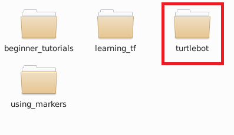
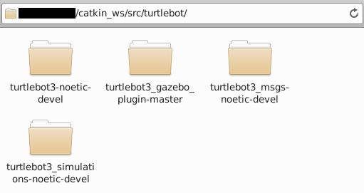

# 4-2：Turtlebot3の環境構築

[前ページ(4-1：Turtlebot3の概要)](./4-01.md)　｜　[目次へ戻る](../index.md)　｜　[次ページ(4-3：GazeboとTurtlebot3の簡単なシミュレーション)](./04_turtlebot/4-03md)
- - -
ここではTurtlebot3のROSパッケージの環境構築について説明します。

## Turtlebot3に関連するROSパッケージのダウンロード

まずはTurtlebot3のシミュレーションを行うのに必要なROSパッケージをダウンロードします。

以下のGithubのリンクを開き、それぞれのパッケージをワークスペースの「src」ディレクトリ内にダウンロードします。Noeticバージョン対応のリポジトリが存在するので、ちゃんとそれをダウンロードするようにしてください。

|パッケージリンク|説明|
|---|---|
|[turtlebot3(本体)](https://github.com/ROBOTIS-GIT/turtlebot3/tree/noetic-devel)|Turtlebot3本体。|
|[turtlebot3_msgs](https://github.com/ROBOTIS-GIT/turtlebot3_msgs/tree/noetic-devel)|Turtlebot3で使うメッセージ。|
|[turtlebot3_simulations](https://github.com/ROBOTIS-GIT/turtlebot3_simulations/tree/noetic-devel)|Turtlebot3で使うシミュレーション関連。|
|[turtlebot3_gazebo_plugin](https://github.com/ROBOTIS-GIT/turtlebot3_gazebo_plugin)|Turtlebot3の3Dモデルやワールド関連。|

では、実際にダウンロードをやっていきます。

まずはワークスペースの「src」ディレクトリに移動します。

~~~shell
cd ~/catkin_ws/src
~~~

ワークスペースの「src」ディレクトリ内であれば階層が深くてもパッケージとして検索できます。なので今回はTurtlebot3関連のパッケージをまとめて配置するために「turtlebot」というディレクトリを作成してその中にパッケージを入れることにします。

以下のようにturtlebotディレクトリを作成します。

~~~shell
mkdir turtlebot
~~~

この中にROSパッケージを配置しますが、GithubからはCloneせずzipでダウンロードして解凍という形で良いと思います。

今回はzipでダウンロードして解凍し、以下のように配置しました。

ROSパッケージの配置ができたので、次はビルドをしていきます。

## Turtlebot3に関連するROSパッケージのビルド

解凍したそれぞれのディレクトリにはかなり多くのパッケージが含まれているので、とりあえずワークスペースに移動して全パッケージをビルドしてみます。

~~~shell
cd ~/catkin_ws/src
catkin build
~~~

ビルドすると以下のようにFailedが1、Abandonedが5の合計6個のパッケージがちゃんとビルドできずにエラーになるかと思います。

~~~shell
$ catkin build

###～～～省略～～～

Failed     << turtlebot3_gazebo:cmake               [ Exited with code 1 ]     
Failed    <<< turtlebot3_gazebo                     [ 5.3 seconds ]            
Abandoned <<< turtlebot3                            [ Unrelated job failed ]   
Abandoned <<< turtlebot3_example                    [ Unrelated job failed ]   
Abandoned <<< turtlebot3_navigation                 [ Unrelated job failed ]   
Abandoned <<< turtlebot3_simulations                [ Unrelated job failed ]   
Abandoned <<< turtlebot3_slam                       [ Unrelated job failed ]   
Finished  <<< turtlebot3_bringup                    [ 7.4 seconds ]            
Finished  <<< turtlebot3_fake                       [ 8.2 seconds ]            
[build] Summary: 8 of 14 packages succeeded.                                   
[build]   Ignored:   None.                                                     
[build]   Warnings:  None.                                                     
[build]   Abandoned: 5 packages were abandoned.                                
[build]   Failed:    1 packages failed.                                        
[build] Runtime: 13.8 seconds total.                                           
[build] Note: Workspace packages have changed, please re-source setup files to use them.
~~~

まずはFailedになってる「turtlebot3_gazebo」パッケージからチェックしていきます。

ビルドしたので、まずはおまじないを実行します。

~~~shell
source /opt/ros/noetic/setup.bash
source ~/catkin_ws/devel/setup.bash
~~~

その後、「[2-11：rosコマンド](../02_base/2-11.md)」で出てきたコマンドを使って依存関係をチェックします。

~~~shell
rosdep check turtlebot3_gazebo
~~~

実行すると、以下のように必要なパッケージが表示されます。

~~~shell
$ rosdep check turtlebot3_gazebo

System dependencies have not been satisfied:
apt	ros-noetic-turtlebot3-description
~~~

ですが「turtlebot3-description」は「turtlebot3-noetic-devel」ディレクトリ内に存在しているので、恐らくビルドする順番が前後してしまったためにビルドに失敗していると考えられます。

なので、再度全パッケージをビルドします。「turtlebot3-description」は前回でビルドできているはずなので、以下のようにエラーなくビルドできるはずです。

~~~shell
$ catkin build

###～～～省略～～～

[build] Summary: All 14 packages succeeded!                                    
[build]   Ignored:   None.                                                     
[build]   Warnings:  None.                                                     
[build]   Abandoned: None.                                                     
[build]   Failed:    None.                                                     
[build] Runtime: 11.4 seconds total.                                           
[build] Note: Workspace packages have changed, please re-source setup files to use them.
~~~

エラーなくビルドができていれば、Turtlebot3の環境構築は完了です。

エラーが出た場合は、色々と調べてエラーが出なくなるまで頑張ってください。

次ページからはTurtlebot3を簡単な形で動かしていきます。

- - -
[前ページ(4-1：Turtlebot3の概要)](./4-01.md)　｜　[目次へ戻る](../index.md)　｜　[次ページ(4-3：GazeboとTurtlebot3の簡単なシミュレーション)](./04_turtlebot/4-03md)
- - -