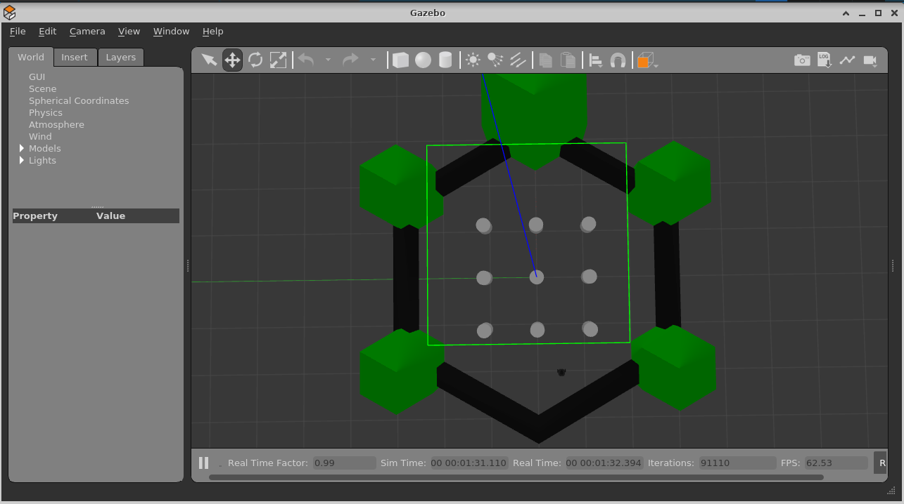
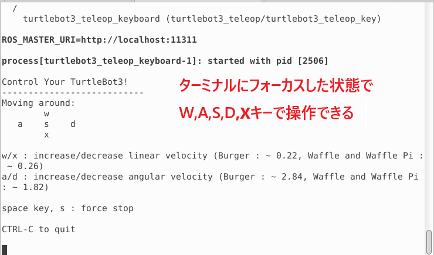
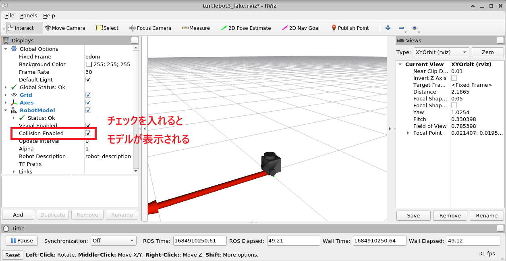

# 4-3：GazeboとTurtlebot3の簡単なシミュレーション

[前ページ(4-2：Turtlebot3の環境構築](./4-02.md)　｜　[目次へ戻る](../index.md)　｜　[次ページ(4-4：地図の作成)](./04_turtlebot/4-04md)
- - -
ここではGazeboとTurtlebot3の簡単なシミュレーションについて説明します。

## Gazeboについて

GazeboとはROSに含まれているrvizとは別の3Dモデルのバーチャルシミュレータです。

基本的にはrvizの方が軽く扱いやすいのであまり使われませんが、Gazeboの方がよりリッチでリアルな3Dシミュレーションを行うことができます。

またGazeboにはいくつかのマップ情報も入っているため、そのマップをシミュレーションとして使うことも多いです。

本マニュアルではGazeboのGUI自体は使わないため詳しく説明はしません。公式ページのリンクを貼っておくのでより知りたい方はそちらを参照してください。

- [Gazebo 公式](https://gazebosim.org/home)

## Gazeboでシミュレーション

Gazeboがどのようなものかを知るために、とりあえず起動させてみます。

Terminalを立ち上げておまじないを実行した後に、以下のコマンドを実行します。

・Terminal1
~~~shell
export TURTLEBOT3_MODEL=burger
roslaunch turtlebot3_gazebo  turtlebot3_world.launch
~~~

起動に時間がかかりますが、以下のようにGazeboのGUIが立ち上がります。ちなみに白い円柱の並んでいる近くにある黒い粒のようなものが環境変数の「TURTLEBOT3_MODEL」で設定した「burger」というロボットの3Dモデルです。

ここで起動せずにエラーになった場合は3Dモデルが正しくない可能性が高いため、[ここのページ](https://ogimotokin.hatenablog.com/entry/2018/06/08/215044)に書かれてあるように3Dモデルをダウンロードして
環境変数の設定を行ってください。

次に新しくTerminalを開いておまじないを実行した後、以下のコマンドを実行します。

・Terminal2
~~~shell
export TURTLEBOT3_MODEL=burger
roslaunch turtlebot3_teleop turtlebot3_teleop_key.launch
~~~

tfの説明の時にも出てきたteleop_keyと同じで、このlaunchファイルを実行したTerminalにフォーカスした状態でW, A, S, D, Xのそれぞれのキー入力でburgerのロボットを操作できます。

Gazeboを閉じるにはTerminal1とTerminal2をそれぞれ「Ctrl + Cキー」の連打で終了させます。閉じる場合もGazeboは時間がかかります。

## rvizでシミュレーション

次はrvizでもシミュレーションを行ってみます。

Terminalを立ち上げておまじないを実行した後に、以下のコマンドを実行します。

・Terminal1
~~~shell
export TURTLEBOT3_MODEL=burger
roslaunch turtlebot3_fake turtlebot3_fake.launch
~~~

rvizが起動するので、以下の赤枠にあるようにRobotModelの「Collision Enabled」にチェックを入れるとモデルが表示されます。

その状態で新しくTerminalを開いておまじないを実行した後、以下のコマンドを実行します。

・Terminal2
~~~shell
export TURTLEBOT3_MODEL=burger
roslaunch turtlebot3_teleop turtlebot3_teleop_key.launch
~~~

Gazeboでモデルを操作したときと同じlaunchファイルなので説明は割愛しますが、これでキーボードからの入力でrviz上のburgerを操作することができます。

実行しているlaunchファイルの中身を見ればどこのファイルを呼び出して何をしているかを追うことができるので、詳しく知りたい方は中身を見てみると良いかと思います。

次ページではこのシミュレーター上で地図を作るやり方を説明していきます。

- - -
[前ページ(4-2：Turtlebot3の環境構築](./4-02.md)　｜　[目次へ戻る](../index.md)　｜　[次ページ(4-4：地図の作成)](./04_turtlebot/4-04md)
- - -